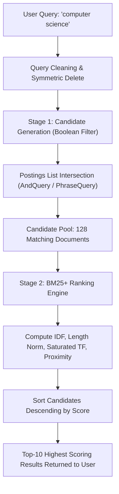
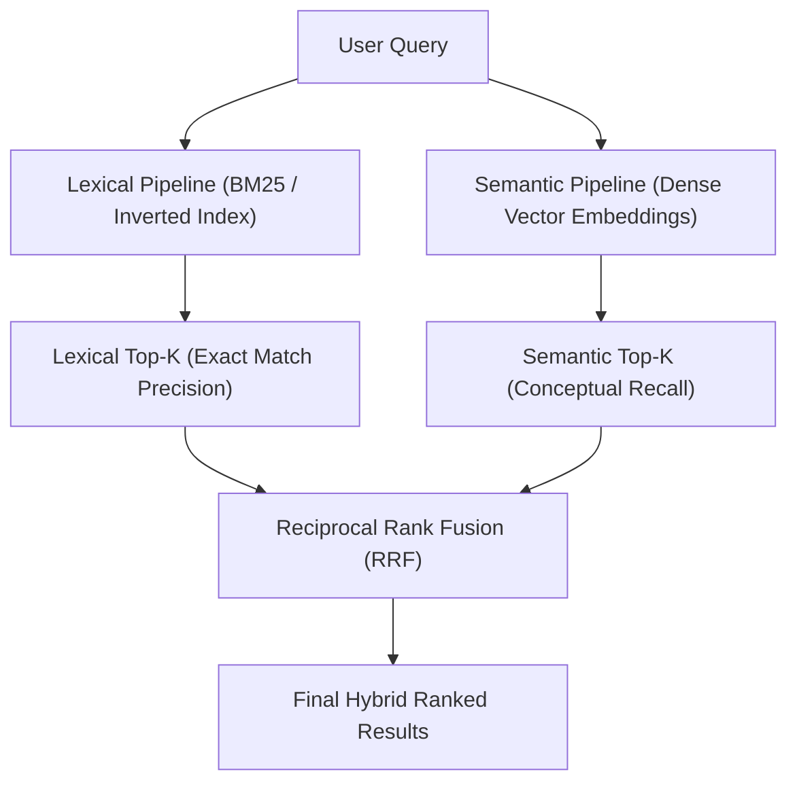

# Building a Search Engine From Scratch — Part 3: Ranking Results with BM25 & Beyond

> *"Finding every document that matches is easy. Deciding which one is the best is what makes a search engine."*

---

## Table of Contents

1. [Where We Left Off: The Boolean Wall](#1-where-we-left-off-the-boolean-wall)
2. [Why Boolean Search Fails (The Relevance Crisis)](#2-why-boolean-search-fails-the-relevance-crisis)
3. [The Core Intuitions of Information Retrieval](#3-the-core-intuitions-of-information-retrieval)
4. [From Counts to Weights: The Story of TF-IDF](#4-from-counts-to-weights-the-story-of-tf-idf)
5. [The Flaws of Pure TF-IDF (Why We Need BM25)](#5-the-flaws-of-pure-tf-idf-why-we-need-bm25)
6. [The Probabilistic Relevance Framework & Okapi BM25](#6-the-probabilistic-relevance-framework--okapi-bm25)
7. [The Anatomy of the BM25 Equation (First Principles)](#7-the-anatomy-of-the-bm25-equation-first-principles)
   - [Part A — Inverse Document Frequency ($IDF$)](#part-a--inverse-document-frequency-idf)
   - [Part B — Document Length Normalization ($B(D)$) and Parameter $b$](#part-b--document-length-normalization-bd-and-parameter-b)
   - [Part C — Term Frequency Saturation and Parameter $k_1$](#part-c--term-frequency-saturation-and-parameter-k_1)
   - [Part D — Query Term Frequency Weighting and Parameter $k_3$](#part-d--query-term-frequency-weighting-and-parameter-k_3)
   - [The Full Master Okapi BM25 Equation](#the-full-master-okapi-bm25-equation)
8. [The Negative IDF Anomaly & The Modern Fix](#8-the-negative-idf-anomaly--the-modern-fix)
9. [Modern Enhancements: Overcoming BM25's Historical Flaws](#9-modern-enhancements-overcoming-bm25s-historical-flaws)
   - [Enhancement 1 — BM25+ and the Delta Floor (Lv & Zhai, 2011)](#enhancement-1--bm25-and-the-delta-floor-lv--zhai-2011)
   - [Enhancement 2 — BM25L (Length-Regularized TF)](#enhancement-2--bm25l-length-regularized-tf)
   - [Enhancement 3 — Term Proximity Scoring (BM25-TP)](#enhancement-3--term-proximity-scoring-bm25-tp)
   - [Enhancement 4 — Reciprocal Rank Fusion (RRF) for Hybrid Search](#enhancement-4--reciprocal-rank-fusion-rrf-for-hybrid-search)
10. [The Two-Stage Architecture: Filter, Then Rank](#10-the-two-stage-architecture-filter-then-rank)
11. [Data Structures & Corpus Profiling](#11-data-structures--corpus-profiling)
12. [A Complete Worked Example (Pen and Paper Math)](#12-a-complete-worked-example-pen-and-paper-math)
13. [The Mathematics of BM25 (Summary Reference Sheet)](#13-the-mathematics-of-bm25-summary-reference-sheet)
14. [Implementing This in Your Language of Choice](#14-implementing-this-in-your-language-of-choice)
15. [Engineering Notes, Trade-offs and Best Practices](#15-engineering-notes-trade-offs-and-best-practices)
16. [Conclusion: From Foundations to Specialization](#16-conclusion-from-foundations-to-specialization)
17. [References and Further Reading](#17-references-and-further-reading)

---

## 1. Where We Left Off: The Boolean Wall

In [Part 1](buildingtheindex.md), we converted 50,000 raw Wikipedia articles into an optimized **positional inverted index**, mapping terms to sorted postings lists containing exact token positions.

In [Part 2](addingquerying.md), we built a query engine with symmetric delete spelling correction that executes **AND queries** (finding documents containing all query terms) and **Phrase queries** (verifying strict positional adjacency).

When you run an AND query for `computer science`, the engine responds:

```text
Found 1,842 matching documents: [4, 19, 23, 78, 105, 112, 145, 198, ...]
```

Here lies the problem: **Which document should the user read first?**

Document `4` appears first simply because it was parsed fourth when the Wikipedia dump was unzipped. It might mention the word `computer` once in a passing footnote and the word `science` once in an external bibliography. Meanwhile, Document `1420` might be the official Wikipedia page titled *"Computer science"*, where the terms appear 85 times across the introduction and main headers.

To a Boolean retrieval engine, both documents are identical. They both evaluate to `True`.

This is the **Boolean Wall**. In real-world retrieval, returning an unranked list of 1,800 documents is barely more useful than returning nothing at all. Today, we break down that wall by implementing **ranking from first principles**.

---

## 2. Why Boolean Search Fails (The Relevance Crisis)

Boolean retrieval treats search as a binary decision problem:

$$
\text{Relevance}(D, Q) \in \{0, 1\}
$$

A document either matches or it does not. In the real world, human relevance is continuous:

$$
\text{Relevance}(D, Q) \in [0.0, \infty)
$$

| Dimension | Boolean Retrieval | Ranked Retrieval (BM25) |
|---|---|---|
| **View of Relevance** | Binary (Yes or No) | Continuous spectrum of probability |
| **Term Frequency** | Ignores how often a term appears (1 is the same as 100) | Rewards higher frequency with diminishing returns |
| **Term Specificity** | Treats rare terms and common terms with equal weight | Rewards rare, informative words heavily |
| **Document Length** | Biased towards long documents (they have more chances to match) | Normalizes for length to maintain fairness |
| **Output Order** | Arbitrary (typically by database index or Doc ID) | Strictly sorted from most relevant to least relevant |

To solve this, our search engine must assign every candidate document a floating-point **relevance score** and sort the documents in descending order.

---

## 3. The Core Intuitions of Information Retrieval

Before looking at mathematical equations, consider what a human brain does when evaluating whether an article is relevant to a query:

### Intuition 1: Term Frequency ($tf$)
If an article mentions `quantum` 20 times, it is far more likely to be about quantum physics than an article that mentions `quantum` once in a passing metaphor. More occurrences imply greater topical focus.

### Intuition 2: Diminishing Returns (Saturation)
If an article mentions `quantum` 2 times instead of 1, that is massive evidence of relevance. But if an article mentions `quantum` 80 times instead of 79, does that 80th occurrence make it twice as relevant? No. The marginal relevance of each additional occurrence decays. Term frequency must **saturate**.

### Intuition 3: Inverse Document Frequency ($idf$)
Not all words are created equal. In the query `history of quantum mechanics`, the word `quantum` is rare across the collection, while `history` is common. A match on `quantum` should carry ten times more weight than a match on `history`. The rarer a term is across the entire corpus, the more informational value it carries.

### Intuition 4: Document Length Normalization
A 50,000-word textbook naturally contains more words than a 300-word encyclopedia entry. If you search for `teleportation`, the textbook might mention it 3 times simply because it has 50,000 words covering everything. The short entry mentions it 3 times because it is *entirely* about teleportation. A fair algorithm must penalize long documents so they do not dominate search results purely through sheer volume.

---

## 4. From Counts to Weights: The Story of TF-IDF

During the 1970s, legendary computer scientist **Karen Spärck Jones** proposed **Inverse Document Frequency (IDF)**, showing that term specificity could be mathematically modeled through statistical rarity. Combined with Hans Peter Luhn's work on **Term Frequency (TF)**, this formed the classic **TF-IDF** scoring model:

$$
\text{Score}_{\text{TF-IDF}}(D, Q) = \sum_{t \in Q} \text{TF}(t, D) \times \text{IDF}(t)
$$

Where:
* $\text{TF}(t, D)$ is the raw count of term $t$ in document $D$.
* $\text{IDF}(t) = \ln \left( \frac{N}{n_t} \right)$, where $N$ is total documents and $n_t$ is the number of documents containing term $t$.

TF-IDF was a breakthrough, but in practice, search engines using raw TF-IDF suffer from two critical failure modes.

---

## 5. The Flaws of Pure TF-IDF (Why We Need BM25)

### Flaw 1: The Linear Term Frequency Trap
In classic TF-IDF, term frequency scales linearly. If Document A mentions `algorithm` 1 time, it gets a score of $1 \times \text{IDF}$. If a spam document repeats the word `algorithm` 500 times, it receives a score of $500 \times \text{IDF}$. 

Linear scaling incentivizes keyword stuffing and fails to reflect human judgment. A document with 500 repetitions is rarely 500 times more relevant than a document with 5.


### Flaw 2: The Document Length Bias
Raw TF-IDF does not account for document length. Long, verbose documents that cover hundreds of unrelated topics match virtually every query term multiple times, completely crowding short, focused documents out of the top results.

---

## 6. The Probabilistic Relevance Framework & Okapi BM25

In the late 1980s and early 1990s, **Stephen Robertson**, **Steve Walker**, **Karen Spärck Jones**, and colleagues at the **City University of London** set out to place information retrieval on a sound mathematical foundation. 

They developed the **Probabilistic Relevance Framework** and entered the annual **Text REtrieval Conference (TREC)** competitions funded by DARPA and NIST. Their system was called **Okapi**. 

Over iterations, they tested different ranking functions:
* BM1 (Best Match 1)
* BM11 (incorporating length normalization)
* BM15 (incorporating term saturation)

At **TREC-3 in 1994**, they combined the saturation curve of BM15 with the length normalization of BM11 into a single formulation: **Best Matching 25**, or **Okapi BM25**.

Over thirty years later, despite the advent of neural vector search, dense embeddings, and cross-encoders, BM25 remains the primary lexical workhorse of search engines worldwide, powering **Apache Lucene, Elasticsearch, OpenSearch, Solr**, and modern hybrid retrieval engines.

---

## 7. The Anatomy of the BM25 Equation (First Principles)

The full Okapi BM25 formula looks intimidating at first glance:

$$
\text{Score}_{\text{BM25}}(D, Q) = \sum_{t \in Q} \text{IDF}(t) \cdot \frac{f(t, D) \cdot (k_1 + 1)}{f(t, D) + k_1 \cdot \left( (1 - b) + b \cdot \frac{|D|}{\text{avgdl}} \right)} \cdot \frac{qf(t) \cdot (k_3 + 1)}{qf(t) + k_3}
$$

Let's break this equation down into its constituent parts.

---

### Part A — Inverse Document Frequency ($IDF$)

The IDF factor measures how much information a term provides across the entire collection.

Under the **Robertson-Spärck Jones (RSJ)** probabilistic relevance formulation derived from the Binary Independence Model:

$$
\text{IDF}_{\text{RSJ}}(t) = \ln \left( \frac{N - n_t + 0.5}{n_t + 0.5} \right)
$$

| Variable | Description |
|---|---|
| $N$ | Total number of documents in the collection (e.g., 50,000) |
| $n_t$ | Document frequency of term $t$ (how many documents contain term $t$) |
| $0.5$ | Halving smoothing constant (prevents division by zero) |

#### Intuition:
* If a term is very rare ($n_t = 10$ out of $50,000$), the ratio inside the logarithm is huge: $\approx 50,000 / 10.5 \approx 4,761$. Its natural logarithm is $\approx 8.46$. Matches on this word contribute heavily.
* If a term is moderately common ($n_t = 5,000$), the ratio is $\approx 45,000 / 5,000.5 \approx 9.0$. Its natural logarithm drops to $\approx 2.19$.

---

### Part B — Document Length Normalization ($B(D)$) and Parameter $b$

To prevent long documents from dominating results simply because they contain more words, BM25 defines a document length multiplier, denoted as $B(D)$:

$$
B(D) = (1 - b) + b \cdot \frac{|D|}{\text{avgdl}}
$$

| Variable | Description |
|---|---|
| $|D|$ | Length of document $D$ (total count of indexed non-stopword tokens) |
| $\text{avgdl}$ | Average document length across all documents in the corpus ($\frac{1}{N} \sum |D|$) |
| $b$ | Free tuning parameter between $0.0$ and $1.0$ (standard default: **$0.75$**) |

#### How Parameter $b$ Controls Length Penalty:
* If $|D| = \text{avgdl}$ (the document is exactly average length), $\frac{|D|}{\text{avgdl}} = 1.0$. Regardless of $b$, $B(D) = (1 - b) + b = 1.0$. Average documents receive zero penalty and zero boost.
* If a document is twice the average length ($\frac{|D|}{\text{avgdl}} = 2.0$) with default $b = 0.75$:
  $$B(D) = (1 - 0.75) + 0.75 \times 2.0 = 0.25 + 1.50 = 1.75$$
  This $1.75$ inflates the denominator of the term frequency component, penalizing the long document.
* If **$b = 0$**: Length normalization is completely turned off ($B(D) = 1.0$).
* If **$b = 1$**: Full length normalization is enforced (scaling strictly proportional to document length).

---

### Part C — Term Frequency Saturation and Parameter $k_1$

This is the mathematical core of BM25. It replaces linear term frequency with a saturating asymptotic curve:

$$
\text{TF}_{\text{norm}}(t, D) = \frac{f(t, D) \cdot (k_1 + 1)}{f(t, D) + k_1 \cdot B(D)}
$$

| Variable | Description |
|---|---|
| $f(t, D)$ | Raw term frequency (how many times term $t$ appears in document $D$) |
| $B(D)$ | Length normalization factor calculated in Part B |
| $k_1$ | Free tuning parameter, typically between **$1.2$ and $2.0$** (standard default: **$1.5$**) |

#### Understanding the Saturation Limit:
Notice the mathematical behavior of this fraction as term frequency increases:

$$
\lim_{f(t, D) \to \infty} \frac{f(t, D) \cdot (k_1 + 1)}{f(t, D) + k_1 \cdot B(D)} = (k_1 + 1)
$$

With $k_1 = 1.5$, no matter how many times a word is repeated—whether 50 times or 50,000 times—the normalized TF score **cannot exceed $2.5$**.


* **When $k_1 = 0$:** The fraction collapses to $1$ for any document where $f(t, D) > 0$. Term frequency is completely ignored, behaving like a binary existence check.
* **When $k_1 \to \infty$:** The curve becomes linear, behaving like unregularized TF-IDF.

---

### Part D — Query Term Frequency Weighting and Parameter $k_3$

What if a user types a repetitive or long query, such as `coffee coffee beans`?

In standard queries, each term appears once ($qf = 1$). But when terms are repeated in long queries, Robertson et al. apply an additional saturation curve to the query side:

$$
\text{QF}_{\text{weight}}(t, Q) = \frac{qf(t) \cdot (k_3 + 1)}{qf(t) + k_3}
$$

| Variable | Description |
|---|---|
| $qf(t)$ | Number of times term $t$ appears in the user query |
| $k_3$ | Tuning parameter, typically between **$1.2$ and $2.0$** (or up to $8.0$) |

If $qf(t) = 1$, the expression evaluates to $\frac{1 \cdot (k_3 + 1)}{1 + k_3} = 1.0$. For standard single-term mentions, this multiplier is exactly $1$.

---

### The Full Master Okapi BM25 Equation

Putting all four components together yields the complete classic formula:

$$
\text{Score}_{\text{BM25}}(D, Q) = \sum_{t \in Q} \underbrace{\ln \left( \frac{N - n_t + 0.5}{n_t + 0.5} \right)}_{\text{IDF}} \times \underbrace{\frac{f(t, D) \cdot (k_1 + 1)}{f(t, D) + k_1 \cdot \left((1 - b) + b \cdot \frac{|D|}{\text{avgdl}}\right)}}_{\text{Length-Normalized TF Saturation}} \times \underbrace{\frac{qf(t) \cdot (k_3 + 1)}{qf(t) + k_3}}_{\text{Query Saturation}}
$$

---

## 8. The Negative IDF Anomaly & The Modern Fix

The classic Robertson-Spärck Jones IDF formula has an edge case that caused serious headaches in early search engines:

$$
\text{IDF}_{\text{RSJ}}(t) = \ln \left( \frac{N - n_t + 0.5}{n_t + 0.5} \right)
$$

Notice what happens when a term appears in more than half of all documents ($n_t > N/2$):

* Suppose $N = 1,000$ and a common word appears in $800$ documents:
  $$\frac{1,000 - 800 + 0.5}{800 + 0.5} = \frac{200.5}{800.5} \approx 0.2504$$
* The natural logarithm of a number less than $1$ is **negative**:
  $$\ln(0.2504) = -1.384$$

If a term's IDF is negative, every time that term appears in a document, it **lowers** the document's total score. A relevant document that mentions the query term multiple times gets penalized simply because the term is widespread.

### The Modern Fix: Smoothed Non-Negative IDF
In 2009, Stephen Robertson and Hugo Zaragoza formalized a smoothed non-negative IDF variant (also adopted as the standard in **Apache Lucene, Elasticsearch, and OpenSearch**):

$$
\text{IDF}_{\text{smooth}}(t) = \ln \left( 1 + \frac{N - n_t + 0.5}{n_t + 0.5} \right)
$$

Because we add $1.0$ inside the logarithm:
* The argument to $\ln(\cdot)$ is always $\ge 1.0$.
* The resulting IDF is **strictly non-negative** ($\ge 0$) for every possible term in the collection.
* Common terms contribute small, positive scores rather than destructive penalties.

---

## 9. Modern Enhancements: Overcoming BM25's Historical Flaws

While Okapi BM25 remains a powerful baseline, Information Retrieval researchers over the years identified several structural limitations and developed targeted mathematical improvements.

### Enhancement 1 — BM25+ and the Delta Floor (Lv & Zhai, 2011)

#### The Problem:
In classic BM25, consider an exceptionally long document (e.g., a complete medical textbook with 200,000 words, where $\text{avgdl} = 500$). 
Here, $\frac{|D|}{\text{avgdl}} = 400$, meaning $B(D) \approx 300$.

Now look at the TF component:

$$
\lim_{|D| \to \infty} \frac{f(t, D) \cdot (k_1 + 1)}{f(t, D) + k_1 \cdot B(D)} = 0
$$

As document length grows, the denominator blows up, driving the entire term contribution toward zero. Even if a comprehensive 50-page survey article mentions the query term 10 times, BM25 penalizes it so severely that a 1-sentence document with a single passing mention can outrank it.

#### The Solution:
In their CIKM 2011 paper, **Yuanhua Lv and ChengXiang Zhai** introduced **BM25+**. They proved that term frequency normalization requires a lower bound to maintain ranking fairness. They introduced a constant **$\delta$ floor** (typically $\delta = 1.0$):

$$
\text{TF}_{\text{BM25+}}(t, D) = \frac{f(t, D) \cdot (k_1 + 1)}{f(t, D) + k_1 \cdot B(D)} + \delta
$$

By adding $\delta$, every document that contains the query term is guaranteed to receive at least:

$$
\delta \times \text{IDF}(t)
$$

This prevents long, high-quality documents from being unfairly penalized.

---

### Enhancement 2 — BM25L (Length-Regularized TF)

Also introduced by Lv and Zhai (2011), **BM25L** addresses length bias by normalizing the term frequency count *before* it enters the saturation function:

$$
c'(t, D) = \frac{f(t, D)}{B(D)}
$$

$$
\text{TF}_{\text{BM25L}}(t, D) = \frac{(k_1 + 1) \cdot (c' + \delta)}{k_1 + (c' + \delta)}
$$

This formulation stabilizes term frequency across widely varying document collections (such as web crawls containing both tweet-length snippets and multi-volume books).

---

### Enhancement 3 — Term Proximity Scoring (BM25-TP)

Classic BM25 is fundamentally a **Bag-of-Words** model: it counts term frequencies but treats a document as an unordered soup of words.

Recall that in Part 1 and Part 2, our inverted index recorded the **exact token positions** of every word. We can use those positions for more than just strict phrase matching.

When a user searches for `computer science`, consider two documents:
* **Document A:** Contains `computer` at position 12 and `science` at position 13 (distance = 1).
* **Document B:** Contains `computer` at position 5 and `science` at position 840 (distance = 835).

Classic BM25 gives both documents the exact same score. But humans know Document A is almost certainly about computer science as a unified discipline, whereas Document B happened to mention both words across different chapters.

#### The Mathematical Proximity Bonus (Büttcher et al., 2006):
For each pair of distinct query terms $q_i, q_j$, find their minimum distance in the document:

$$
\text{dist}_{\min}(q_i, q_j) = \min_{p_i \in \text{pos}(q_i), p_j \in \text{pos}(q_j)} |p_i - p_j|
$$

Then calculate an inverse-distance proximity score with quadratic decay:

$$
\text{ProximityBonus}(D, Q) = \sum_{i < j} \frac{1}{\left( \text{dist}_{\min}(q_i, q_j) \right)^2}
$$

* If two terms are consecutive ($\text{dist} = 1$), the bonus is $1 / 1^2 = 1.0$.
* If they are 2 words apart ($\text{dist} = 2$), the bonus is $1 / 2^2 = 0.25$.
* If they are 20 words apart ($\text{dist} = 20$), the bonus drops to $1 / 400 = 0.0025$.

Adding this proximity bonus directly bridges the gap between flexible keyword search and strict phrase matching.

---

### Enhancement 4 — Reciprocal Rank Fusion (RRF) for Hybrid Search

In modern search architectures, multiple retrieval methods run in parallel:
1. **BM25** (for exact keyword and entity matching)
2. **Phrase Search** (for strict sequence matching)
3. **Dense Vector Search** (for conceptual semantic matching)

How do you combine results from systems that output completely incompatible score distributions? (BM25 outputs scores from $0$ to $50+$, while cosine similarity outputs $0.0$ to $1.0$).

In 2009, **Cormack, Clarke, and Büttcher** introduced **Reciprocal Rank Fusion (RRF)**:

$$
\text{RRF}(d) = \sum_{m \in \text{Rankers}} \frac{1}{k + \text{rank}_m(d)}
$$

Where $\text{rank}_m(d)$ is the 1-based position of document $d$ in the output of ranker $m$, and $k$ is a constant (standard default: **$k = 60$**).

RRF relies exclusively on ordinal position rather than raw scores, making it immune to calibration mismatch and the dominant fusion standard in modern search pipelines.

---

## 10. The Two-Stage Architecture: Filter, Then Rank

Why shouldn't a search engine simply evaluate the BM25 formula across all 50,000 documents for every search?

Because computing floating-point logarithms, divisions, and positional distances over thousands of documents per query is computationally wasteful.

Modern search engines operate as a **Two-Stage Pipeline**:



1. **Stage 1 (Candidate Retrieval):** The engine uses fast set operations on inverted index postings lists to filter the entire corpus down to documents that match the query logic (e.g., 50,000 docs $\to$ 128 matching docs).
2. **Stage 2 (Scoring & Ranking):** The engine applies the full BM25+ mathematical equation **only to those 128 candidate documents**, sorting them in a few microseconds.
3. **Graceful Fallback:** If Stage 1's strict boolean filter returns zero results, the engine falls back to free-text OR ranking, ensuring the user still receives the most relevant partial matches.

---

## 11. Data Structures & Corpus Profiling

To evaluate BM25, what information does the engine need, and when should it be gathered?

Notice the inputs to the equation:
* Collection document count: $N$
* Average document length: $\text{avgdl}$
* Length of document $D$: $|D|$
* Human-readable document title: $\text{Title}(D)$

### The Bad Approach: Computing at Query Time
Re-reading raw text files to count words at search time destroys query latency. 

### The Good Approach: Index-Time Corpus Profiling
During index construction (Part 1), the indexer already traverses every document and every token. At that exact moment, it records:
1. The article title from `<title>...</title>`.
2. The final token position counter as the document length $|D|$.

It exports these statistics alongside `invertedIndex.txt` as a companion metadata manifest:

```text
CORPUS METADATA MANIFEST SCHEMA:
================================
{
  "N": 50000,
  "avgdl": 487.07,
  "doc_lengths": {
    "0": 412,
    "1": 150,
    "2": 890,
    ...
  },
  "titles": {
    "0": "Anarchism",
    "1": "Autism",
    "2": "Albedo",
    ...
  }
}
```

At query time, the search engine loads this manifest into an in-memory hash table in under 50 milliseconds, enabling instant $O(1)$ lookups for length normalization.

---

## 12. A Complete Worked Example (Pen and Paper Math)

To understand how all these formulas work in practice, let's calculate BM25 scores by hand for a toy corpus.

### The Corpus
* **Document 1 (Doc 1):** Length $|D_1| = 100$ words. Mentions `quantum` 4 times and `mechanics` 2 times.
* **Document 2 (Doc 2):** Length $|D_2| = 50$ words. Mentions `quantum` 1 time and `mechanics` 1 time.
* **Document 3 (Doc 3):** Length $|D_3| = 300$ words. Mentions `quantum` 5 times and `mechanics` 0 times.

### Global Statistics
* Total documents: $N = 1,000$
* Document frequency of `quantum`: $n_{\text{quantum}} = 50$
* Document frequency of `mechanics`: $n_{\text{mechanics}} = 200$
* Total tokens in corpus = $150,000 \implies \text{avgdl} = 150$
* Parameters: $k_1 = 1.5$, $b = 0.75$, $\delta = 1.0$ (BM25+)
* Query: `quantum mechanics` (each term appears once: $qf = 1 \implies \text{QF}_{\text{weight}} = 1.0$)

---

### Step 1: Calculate Smoothed IDFs

$$
\text{IDF}_{\text{smooth}}(\text{quantum}) = \ln \left( 1 + \frac{1000 - 50 + 0.5}{50 + 0.5} \right) = \ln \left( 1 + \frac{950.5}{50.5} \right) = \ln(1 + 18.82) = \ln(19.82) \approx \mathbf{2.9867}
$$

$$
\text{IDF}_{\text{smooth}}(\text{mechanics}) = \ln \left( 1 + \frac{1000 - 200 + 0.5}{200 + 0.5} \right) = \ln \left( 1 + \frac{800.5}{200.5} \right) = \ln(1 + 3.99) = \ln(4.99) \approx \mathbf{1.6074}
$$

*Notice: `quantum` is four times rarer than `mechanics`, so each mention of `quantum` receives nearly double the weight.*

---

### Step 2: Calculate Length Normalization $B(D)$ for Each Document

$$
B(D) = (1 - 0.75) + 0.75 \times \frac{|D|}{150} = 0.25 + 0.005 \times |D|
$$

* **Doc 1 ($|D| = 100$):** $B(D_1) = 0.25 + 0.50 = \mathbf{0.75}$ *(below average length $\to$ boost)*
* **Doc 2 ($|D| = 50$):** $B(D_2) = 0.25 + 0.25 = \mathbf{0.50}$ *(short document $\to$ large boost)*
* **Doc 3 ($|D| = 300$):** $B(D_3) = 0.25 + 1.50 = \mathbf{1.75}$ *(long document $\to$ penalty)*

---

### Step 3: Calculate BM25+ Saturated Term Frequencies

$$
\text{TF}_{\text{BM25+}} = \frac{f \times (1.5 + 1)}{f + 1.5 \times B(D)} + 1.0 = \frac{2.5 \times f}{f + 1.5 \times B(D)} + 1.0
$$

#### For Document 1:
* `quantum` ($f = 4$, $B = 0.75$):
  $$\text{TF} = \frac{2.5 \times 4}{4 + 1.5 \times 0.75} + 1.0 = \frac{10}{4 + 1.125} + 1.0 = \frac{10}{5.125} + 1.0 = 1.951 + 1.0 = \mathbf{2.951}$$
* `mechanics` ($f = 2$, $B = 0.75$):
  $$\text{TF} = \frac{2.5 \times 2}{2 + 1.125} + 1.0 = \frac{5}{3.125} + 1.0 = 1.600 + 1.0 = \mathbf{2.600}$$

#### For Document 2:
* `quantum` ($f = 1$, $B = 0.50$):
  $$\text{TF} = \frac{2.5 \times 1}{1 + 1.5 \times 0.50} + 1.0 = \frac{2.5}{1 + 0.75} + 1.0 = \frac{2.5}{1.75} + 1.0 = 1.429 + 1.0 = \mathbf{2.429}$$
* `mechanics` ($f = 1$, $B = 0.50$):
  $$\text{TF} = \frac{2.5 \times 1}{1.75} + 1.0 = \mathbf{2.429}$$

#### For Document 3:
* `quantum` ($f = 5$, $B = 1.75$):
  $$\text{TF} = \frac{2.5 \times 5}{5 + 1.5 \times 1.75} + 1.0 = \frac{12.5}{5 + 2.625} + 1.0 = \frac{12.5}{7.625} + 1.0 = 1.639 + 1.0 = \mathbf{2.639}$$
* `mechanics` ($f = 0$): $\text{TF} = \mathbf{0.0}$

---

### Step 4: Multiply and Sum Final Document Scores

$$
\text{Total Score} = \left( \text{IDF}_{\text{quantum}} \times \text{TF}_{\text{quantum}} \right) + \left( \text{IDF}_{\text{mechanics}} \times \text{TF}_{\text{mechanics}} \right)
$$

| Document | Quantum Component | Mechanics Component | Total Score | Rank |
|---|---|---|---|:---:|
| **Doc 1** | $2.9867 \times 2.951 = \mathbf{8.814}$ | $1.6074 \times 2.600 = \mathbf{4.179}$ | **12.993** | **#1** |
| **Doc 2** | $2.9867 \times 2.429 = \mathbf{7.255}$ | $1.6074 \times 2.429 = \mathbf{3.904}$ | **11.159** | **#2** |
| **Doc 3** | $2.9867 \times 2.639 = \mathbf{7.882}$ | $1.6074 \times 0.000 = \mathbf{0.000}$ | **7.882** | **#3** |

### Why This Ranking Makes Intuitive Sense:
1. **Doc 1 wins decisively (#1):** It is moderately short and contains strong, repeated matches for both terms.
2. **Doc 2 takes second place (#2):** Despite having only a single mention of each word, it is very compact (50 words) and covers both query terms.
3. **Doc 3 places last (#3):** Even though it mentioned `quantum` 5 times, it is long (300 words), diluting its focus, and completely failed to mention `mechanics`.

---

## 13. The Mathematics of BM25 (Summary Reference Sheet)

| Component | Mathematical Formula | Canonical Purpose | Typical Values |
|---|---|---|:---:|
| **Smoothed IDF** | $\ln \left( 1 + \frac{N - n_t + 0.5}{n_t + 0.5} \right)$ | Rewards rare terms; prevents negative weights | $\ge 0.0$ |
| **Length Norm $B(D)$** | $(1 - b) + b \cdot \frac{\lvert D \rvert}{\text{avgdl}}$ | Normalizes for document verbosity | $b = 0.75$ |
| **Classic TF Saturation** | $\frac{\text{tf} \cdot (k_1 + 1)}{\text{tf} + k_1 \cdot B(D)}$ | Dampens impact of repeated terms | $k_1 = 1.2 \dots 2.0$ |
| **BM25+ Saturation** | $\frac{\text{tf} \cdot (k_1 + 1)}{\text{tf} + k_1 \cdot B(D)} + \delta$ | Prevents over-penalization of long documents | $\delta = 1.0$ |
| **Query TF Weight** | $\frac{\text{qtf} \cdot (k_3 + 1)}{\text{qtf} + k_3}$ | Handles repeated terms in verbose queries | $k_3 = 1.2$ |
| **Term Proximity** | $\sum_{i < j} \frac{1}{(\min \lvert p_i - p_j \rvert)^2}$ | Rewards co-located query terms | Exponent $= 2.0$ |
| **Rank Fusion (RRF)** | $\sum_m \frac{1}{k + \text{rank}_m(d)}$ | Fuses lexical and semantic rankings | $k = 60$ |

---

## 14. Implementing This in Your Language of Choice

To implement this ranking engine in your language of choice (C++, Go, Rust, Java, Python, C#, etc.), follow this architectural pattern:

### 1. In-Memory Data Structures

```text
DATA STRUCTURES SCHEMA:
======================

InvertedIndex:
  Map<Term, Map<DocID, List<Integer>>>
  // Maps term -> document -> sorted token positions

CorpusMetadata:
  TotalDocuments: Integer                     // N
  AverageDocumentLength: Float                // avgdl
  DocumentLengths: Map<DocID, Integer>        // |D| for each doc
  DocumentTitles: Map<DocID, String>          // Human-readable titles

RankedResult:
  DocID: Integer
  Score: Float
  Title: String
```

### 2. The Algorithmic Retrieval Flow

```text
ALGORITHM: RankQuery(UserQuery, Index, Metadata, TopK)
======================================================
1. Clean, tokenize, remove stop words, and stem UserQuery.
2. Count frequency of each distinct term in the query -> QueryFreqs.
3. CandidateDocs = Retrieve candidates using Boolean Stage 1 (AND / Phrase).
   If CandidateDocs is empty:
       CandidateDocs = Union of docs containing ANY query term (OR pool).

4. Precompute IDF for each query term using Metadata.TotalDocuments.
5. ScoredList = Empty List.

6. For each DocID in CandidateDocs:
       DocScore = 0.0
       PositionsMap = Empty Map.
       DocLength = Metadata.DocumentLengths[DocID]

       For each Term in QueryFreqs.Keys:
           If Term exists in Index and DocID exists in Index[Term]:
               Positions = Index[Term][DocID]
               TF = Length(Positions)
               PositionsMap[Term] = Positions

               TF_Score = ComputeBM25Plus(TF, DocLength, Metadata.AverageDocumentLength)
               QF_Weight = ComputeQueryWeight(QueryFreqs[Term])
               
               DocScore += (IDF[Term] * TF_Score * QF_Weight)

       If PositionsMap has 2 or more terms:
           ProximityBonus = ComputePairwiseProximity(PositionsMap)
           DocScore += (0.5 * ProximityBonus)

       Append (DocID, DocScore, Metadata.DocumentTitles[DocID]) to ScoredList.

7. Sort ScoredList by DocScore descending.
8. Return the first TopK items of ScoredList.
```

---

## 15. Engineering Notes, Trade-offs and Best Practices

### 1. Precomputing vs. On-the-Fly IDF
Vocabulary sizes in production easily reach hundreds of thousands of words. While you can precalculate IDF for the entire dictionary at startup, evaluating IDF on the fly during query processing takes less than 50 nanoseconds per query term. Caching IDF on an LRU cache or dynamically computing it at query time saves significant memory.

### 2. Tuning $k_1$ and $b$
* **For short, title-focused documents** (e.g., e-commerce products, movie titles): lower $b$ to $0.3 - 0.5$ because title length variance is low.
* **For highly heterogeneous text** (e.g., academic papers, encyclopedia articles, blogs): keep $b$ at $0.75$ and use **BM25+** ($\delta = 1.0$) to avoid starving long documents.
* **For verbose queries** (e.g., question answering, conversational search): increase $k_1$ toward $2.0$ to allow term frequency differences to exert more influence.

### 3. Positional Proximity Complexity
Calculating pairwise minimum distances between two lists of positions can be done in linear time:

$$
O(|\text{pos}_1| + |\text{pos}_2|)
$$

Using a **two-pointer scan**, initialize a pointer at the beginning of each sorted position list. At each step, measure $|p_1 - p_2|$, update the minimum distance, and increment the pointer pointing to the smaller position. If the distance ever equals $1$ (adjacent bigram), you can immediately terminate the loop.

---

## 16. Conclusion: From Foundations to Specialization

With ranking in place, we have completed the core journey of **building a search engine from scratch**:

* **Part 1 (The Index):** Built a single-pass positional inverted index from raw text, handling tokenization, stop words, Porter stemming, and sequential token tracking.
* **Part 2 (The Query Engine):** Built a query engine capable of sub-millisecond index loading, Symmetric Delete spelling correction, multi-term Boolean AND queries, and positional exact phrase matching.
* **Part 3 (The Ranking Engine):** Built the complete probabilistic relevance framework:
  * Term Frequency Saturation ($k_1$) to prevent keyword stuffing.
  * Document Length Normalization ($b$) to ensure fair competition between short notes and long articles.
  * Non-Negative Smoothed IDF to resolve the negative weight anomaly on common words.
  * BM25+ delta flooring ($\delta$) to eliminate long-document starvation.
  * Positional Term Proximity (BM25-TP) to reward natural phrasing without rigid quoting.
  * Index-time corpus metadata profiling to keep query execution sub-millisecond.

Our search engine no longer just returns documents that happen to contain matching letters; it returns answers ordered by statistical relevance.

---

### A Word on Modern Hybrid Search and Neural Embeddings

As of 2026, state-of-the-art production search systems frequently combine lexical algorithms like BM25 with **Dense Neural Vector Search** in what is known as **Hybrid Search**:



In this series, we deliberately focused on building a pure lexical engine with BM25. Why?

1. **Compute Efficiency:** Neural vector models (bi-encoders, transformer embeddings) require heavy GPU compute or intensive CPU matrix multiplications. BM25 runs in microseconds on any CPU with zero model dependencies.
2. **Storage and Memory Footprint:** A dense 768-dimensional float32 vector takes ~3 KB per document. For millions of documents, raw vectors require tens of gigabytes of RAM and specialized Approximate Nearest Neighbor (ANN) index structures like HNSW or IVF-PQ. An inverted index, by comparison, compresses down to a fraction of that size.
3. **Exact-Match Precision:** Pure vector embeddings excel at broad conceptual intent (e.g., realizing that *"automobile repair"* is related to *"car mechanic"*), but they often suffer from "semantic drift"—struggling with exact product codes, SKUs, error logs, specific names, and rare jargon. BM25 provides an infallible guardrail for literal precision.

In enterprise architectures, the gold standard is not replacing BM25 with vectors, but pairing them: using BM25 for precision, dense vectors for semantic synonyms, and fusing their ranked lists using **Reciprocal Rank Fusion (RRF)**.

---

### Where We Go From Here: Two Specialized Paths

Now that the core fundamentals of Information Retrieval are firmly in place, the path forward splits into two distinct, specialized engineering disciplines:

#### Track 1: Building a Web Search Engine (The Google Route)
* **Domain:** *Web-Scale Information Retrieval & Web Crawling Systems*
* **The Challenge:** The open Web is not a clean, static text file. It is dynamic, adversarial, and distributed across billions of servers.
* **What to Build Next:**
  * **Distributed Web Crawlers:** Politeness policies, robots.txt parsers, DNS resolution caches, and URL frontier queues.
  * **Link Graph Analysis & PageRank:** Analyzing backlinks and calculating authority scores to combat web spam and rank authoritative pages first.
  * **Anchor Text Propagation:** Indexing the text inside hyperlinks pointing *to* a page as if it were part of the target page's own content.
  * **Incremental Crawl & Freshness Engines:** Updating real-time news while maintaining a massive cold archive.

#### Track 2: Building an Embedded Search Library and Search Engine Server (The Lucene, Elasticsearch & Algolia Route)
* **Domain:** *Search Engine Libraries, Distributed Search Systems, and Search-as-a-Service Engines*
* **The Players:**
  * **Search Engine Library** (*like Apache Lucene*): A low-level, embeddable software library providing immutable index segments, LSM-tree style commit merges, bitset filters, and compound file formats.
  * **Distributed Search & Analytics Engine** (*like Elasticsearch and OpenSearch*): A distributed, document-oriented server wrapping Lucene to handle JSON documents, dynamic sharding, cross-node replication, and horizontal cluster scaling.
  * **Instant Search / Search-as-a-Service Engine** (*like Algolia, Typesense, and Meilisearch*): In-memory, typo-tolerant search engines optimized for sub-10ms "search-as-you-type" query latency, instant prefix matching, and structured faceted filtering.
* **What to Build Next:**
  * **Segment-Based Architecture:** Moving from a monolithic index file to immutable, append-only segment files merged in the background.
  * **Real-Time Indexing:** Adding document insertions, updates, and soft deletes without re-indexing the whole corpus.
  * **Faceted Search & Multi-Field Boosting:** Filtering by categories, price ranges, and dates while boosting titles over body text.

The foundational principles you built across these three posts—token streams, inverted indexes, positional postings, and probabilistic BM25 saturation—are the bedrock under every one of those systems. Master the fundamentals, and every specialized search architecture becomes an extension of the same elegant core.

---

## 17. References and Further Reading

1. **Robertson, S. E., Walker, S., Jones, S., Hancock-Beaulieu, M. M., & Gatford, M. (1994).** *"Okapi at TREC-3."* Proceedings of the Third Text REtrieval Conference (TREC-3), NIST Special Publication 500-225.
2. **Robertson, S., & Zaragoza, H. (2009).** *"The Probabilistic Relevance Framework: BM25 and Beyond."* Foundations and Trends in Information Retrieval, Vol. 3, No. 4, pp. 333–389.
3. **Spärck Jones, K. (1972).** *"A statistical interpretation of term specificity and its application in retrieval."* Journal of Documentation, Vol. 28, No. 1, pp. 11–21.
4. **Lv, Y., & Zhai, C. (2011).** *"Lower-bounding term frequency normalization."* Proceedings of the 20th ACM Conference on Information and Knowledge Management (CIKM '11), pp. 7–16.
5. **Büttcher, S., Clarke, C. L., & Cormack, G. V. (2006).** *"Term proximity scoring for robust information retrieval."* Proceedings of the 29th Annual International ACM SIGIR Conference, pp. 25–32.
6. **Cormack, G. V., Clarke, C. L., & Büttcher, S. (2009).** *"Reciprocal rank fusion outperforms condorcet and individual rank learning methods."* Proceedings of the 32nd International ACM SIGIR Conference, pp. 758–759.
