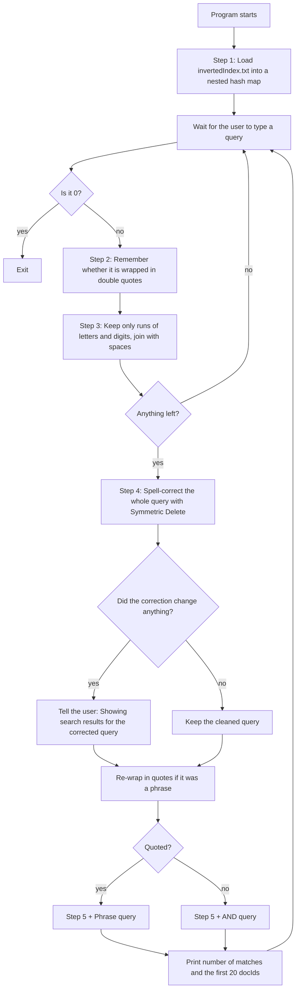
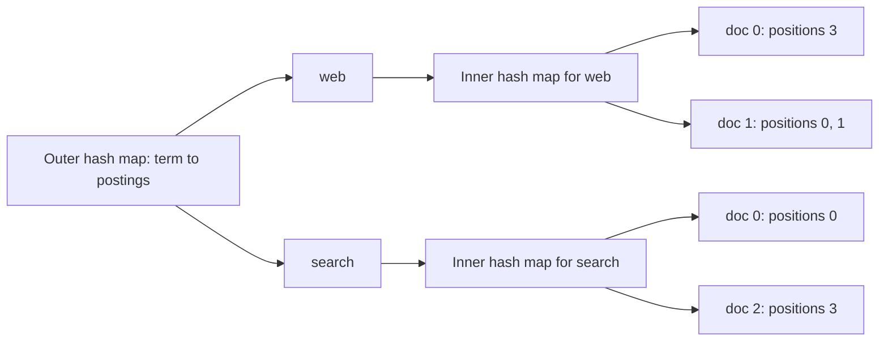
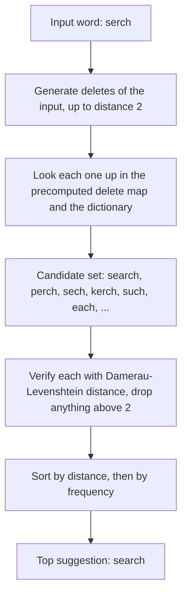
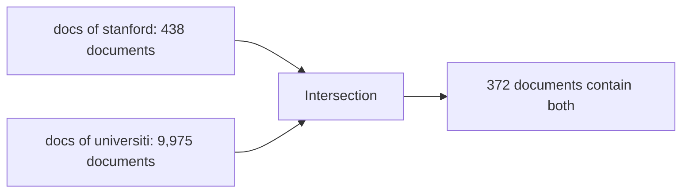
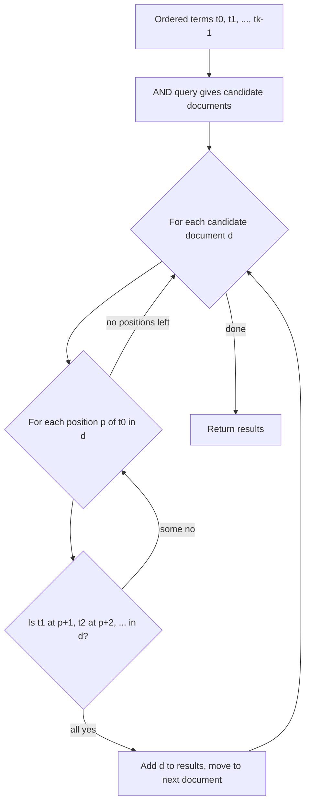
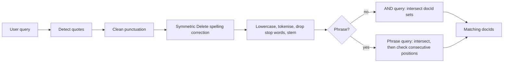

# Building a Search Engine From Scratch — Part 2: Querying the Inverted Index

> *An index is a promise: "I already know where every word lives." A query engine is how you collect on that promise without wasting a single millisecond.*

---

## Table of Contents

1. [Where We Left Off](#1-where-we-left-off)
2. [What a Query Engine Has to Do](#2-what-a-query-engine-has-to-do)
3. [The Query Pipeline at a Glance](#3-the-query-pipeline-at-a-glance)
4. [Step 1 — Loading the Index Back Into Memory](#4-step-1--loading-the-index-back-into-memory)
5. [Step 2 — Detecting the Query Type](#5-step-2--detecting-the-query-type)
6. [Step 3 — Cleaning the Raw Query](#6-step-3--cleaning-the-raw-query)
7. [Step 4 — Spelling Correction: The Problem](#7-step-4--spelling-correction-the-problem)
8. [The Mathematics of Typos: Edit Distance](#8-the-mathematics-of-typos-edit-distance)
9. [The "Normal" Approaches to Spelling Correction](#9-the-normal-approaches-to-spelling-correction)
10. [The Symmetric Delete Algorithm (SymSpell)](#10-the-symmetric-delete-algorithm-symspell)
11. [Why Symmetric Delete Instead of the Normal Approach](#11-why-symmetric-delete-instead-of-the-normal-approach)
12. [Correcting Whole Queries, Not Just Words](#12-correcting-whole-queries-not-just-words)
13. [Step 5 — Turning the Query Into Terms](#13-step-5--turning-the-query-into-terms)
14. [Query Type 1 — The AND Query](#14-query-type-1--the-and-query)
15. [Query Type 2 — The Phrase Query](#15-query-type-2--the-phrase-query)
16. [AND Query vs. Phrase Query: The Difference](#16-and-query-vs-phrase-query-the-difference)
17. [A Complete Worked Example](#17-a-complete-worked-example)
18. [The Mathematics of Query Processing](#18-the-mathematics-of-query-processing)
19. [Implementing This in Your Language of Choice](#19-implementing-this-in-your-language-of-choice)
20. [Engineering Notes, Trade-offs and Known Limitations](#20-engineering-notes-trade-offs-and-known-limitations)
21. [Recap and What's Next](#21-recap-and-whats-next)
22. [References and Further Reading](#22-references-and-further-reading)

---

## 1. Where We Left Off

In [Part 1](invertedIndex.md) we took 50,000 Wikipedia articles and built a **positional inverted index**: a map from every **term** (a lowercased, stemmed word) to a **postings list** saying which documents contain it and at exactly which **positions**. We saved it to disk as `invertedIndex.txt`, one term per line:

```text
term|docId:pos,pos,pos;docId:pos,pos;docId:pos
```

We also made some careful promises about that index, called **invariants**:

1. Postings lists are sorted by docId.
2. Positions inside each posting are sorted.
3. No docId appears twice in the same postings list.
4. Positions count *only kept terms* — stop words do not advance the counter.

An index nobody can query is just a very large text file. Today we put it to work. By the end of this post our engine will:

- Load the index back into memory.
- Accept a query typed by a human — typos and all.
- **Fix spelling mistakes** using an algorithm called **Symmetric Delete**.
- Answer two kinds of question: **"which documents contain all of these words?"** (an **AND query**) and **"which documents contain this exact phrase?"** (a **phrase query**).

As in Part 1, **there are no code snippets in this post.** Everything is explained in terms of data structures, algorithms and maths, so you can implement it in any language you like.

---

## 2. What a Query Engine Has to Do

A query engine sits between a human and the index. Humans are messy; indexes are strict. The query engine's job is to translate one into the other.

| The human types... | The index understands... | Who bridges the gap |
|---|---|---|
| `Search Engines!` | `search`, `engin` | Cleaning, lowercasing, tokenising, stemming |
| `serch engnes` | `search`, `engin` | **Spelling correction** |
| `the history of quantum mechanics` | `histori`, `quantum`, `mechan` | Stop word removal + stemming |
| `"stanford university"` (with quotes) | "`stanford` immediately followed by `universiti`" | **Phrase query** using positions |
| `stanford university` (no quotes) | "documents containing `stanford` and `universiti`, anywhere" | **AND query** |

There is one rule from Part 1 that governs everything on the query side:

> **The Golden Rule: whatever you did to the documents at indexing time, you must do to the query at search time — in exactly the same way.**

If the index stores `engin` but the query looks up `engines`, nothing matches. Every step in this post that touches terms is a mirror of a step in Part 1.

---

## 3. The Query Pipeline at a Glance

Here is the full journey of a query from the keyboard to a list of document IDs. Every box is a section below.



Our reference implementation has five pieces:

| Piece | Responsibility |
|---|---|
| `parseIndex` | Reads `invertedIndex.txt` back into memory |
| `process_query` | Runs a query string through the *same* pipeline as Part 1 (lowercase → tokenise → drop stop words → stem) |
| `AndQuery` | Returns documents containing **all** query terms |
| `PhraseQuery` | Returns documents containing the query terms **consecutively, in order** |
| `checkQueryType` | Looks at the quotes and dispatches to one of the two query functions |

And a `main` loop that ties it all together, including the spelling correction.

---

## 4. Step 1 — Loading the Index Back Into Memory

The index on disk is plain text. Before we can search it, we must **deserialise** it: turn the text back into data structures we can look things up in.

### Reading the file

Recall our delimiters from Part 1:

| Delimiter | Separates |
|---|---|
| newline | One term from the next |
| `\|` (pipe) | The term from its postings |
| `;` (semicolon) | One posting from the next |
| `:` (colon) | A docId from its positions |
| `,` (comma) | One position from the next |

Parsing is simply the reverse of writing. For each line in the file:

1. **Trim** surrounding whitespace. If the line is empty, skip it.
2. **Split once on `|`.** The left side is the term; the right side is the postings text. If the line doesn't split into exactly two parts, it's malformed — skip it rather than crash.
3. **Split the postings text on `;`.** Each piece is one posting, like `5:7619`.
4. **Split each posting on `:`.** The left side is the docId; the right side is the positions text.
5. **Split the positions text on `,`** and convert every piece to an integer.
6. Store the result.

We read the file **line by line** (streaming) rather than loading the whole file as one giant string first. That way, at any moment, we only hold one line of raw text plus the structure we're building.

> **Why this is safe:** in Part 1 we noted that terms can only contain `a–z` and `0–9`. None of our delimiters can ever appear inside a term or a number, so simply splitting on each delimiter in turn always reconstructs the index unambiguously. No escaping, no quoting, no edge cases.

### The data structure: a hash map of hash maps

In Part 1, each term pointed to a **list** of `(docId, positions)` pairs. When we load the index for querying, we make one small but important change: each term now points to a **hash map from docId to positions**.

```text
"web"  →  {  0 → [3],   1 → [0, 1]  }
             │    │      │    └── positions inside doc 1
             │    │      └─────── docId 1
             │    └────────────── positions inside doc 0
             └─────────────────── docId 0
```



Why the change? Because of the two questions our queries will keep asking:

| Question | List of pairs | Hash map docId → positions |
|---|---|---|
| "Which documents contain term *t*?" | Walk the list | Take the map's keys |
| "Where does term *t* appear inside document *d*?" | Scan (or binary-search) the list for *d* | **One O(1) lookup** |

The phrase query asks the second question over and over again, so making it O(1) is worth it. The price is a bit more memory per posting and losing the guaranteed docId order — we'll come back to that trade-off in the limitations section.

### What loading our real index looks like

| Metric | Value |
|---|---|
| Index file size on disk | ~169 MB |
| Terms loaded | **500,722** |
| Time to load (reference implementation, one core) | **~25 seconds** |

Twenty-five seconds is a long time to wait, but notice *when* we pay it: **once**, when the program starts. After that, the index sits in memory and every query is answered in **milliseconds**. This is the indexing trade from Part 1 all over again: *pay up-front so that every question is cheap.*

> **Note:** if the file doesn't exist (because the indexer from Part 1 hasn't been run yet), the program reports that clearly and exits instead of crashing.

---

## 5. Step 2 — Detecting the Query Type

Our engine supports two query types, and the user picks between them with a convention borrowed from every major web search engine: **double quotes.**

| User types | Query type | Meaning |
|---|---|---|
| `stanford university` | **AND query** | Documents containing *both* words, anywhere |
| `"stanford university"` | **Phrase query** | Documents containing the words *side by side, in this order* |

The rule is precise: after trimming whitespace, if the query **starts with** a double quote **and ends with** a double quote, it's a phrase query. Otherwise, it's an AND query.

We make this decision **before** doing anything else, and we store it as a simple **boolean flag** (true/false). That's important, because the very next step strips all punctuation — including the quotes. Without remembering the flag first, we'd lose the user's intent.

---

## 6. Step 3 — Cleaning the Raw Query

Next we strip the query down to its bare words. We find every **unbroken run of letters (either case) and digits**, and join them back together with single spaces.

| Raw input | Cleaned |
|---|---|
| `"stanford university"` | `stanford university` |
| `Search   engines!!!` | `Search engines` |
| `C++ & Java?` | `C Java` |
| `???` | *(empty — the user is asked to try again)* |

### Why clean *before* spelling correction?

This is the reason the comment in our implementation gives: **to avoid false-positive spelling corrections.** A spelling corrector looks at every "word" it is given. If it's handed `engines!!!` or `"stanford`, it sees a string that isn't in its dictionary and may try to "fix" it — perhaps by changing the word itself. By removing punctuation first, the corrector only ever sees real word candidates.

Notice the cleaning rule (`[a-zA-Z0-9]+`) keeps **both upper- and lowercase** letters, unlike Part 1's tokeniser (`[a-z0-9]+`, applied after lowercasing). That's deliberate: at this stage we're preparing text for the *spelling corrector*, not the index. The proper index-matching tokenisation happens later, in Step 5.

If nothing is left after cleaning, there's nothing to search for, so we ask the user for a valid query and wait for the next one.

---

## 7. Step 4 — Spelling Correction: The Problem

People make typos. Studies of real search logs routinely find that somewhere around **10–15% of queries contain a spelling mistake**. If a user types `serch engnes`, our index will look up `serch` and `engn`, find nothing, and return zero results — even though we have hundreds of perfectly good documents about search engines.

Web search engines solved this years ago with the familiar *"Showing results for..."* message. We're going to do the same:

```text
Enter query (or 0 to Exit): serch engnes
Showing search results for [search engines]
```

### What "correcting a word" actually means

Given a misspelled input word $w$, we want to find the dictionary word $c$ that the user *most likely meant*. Peter Norvig famously framed this as a probability problem:

$$
\hat{c} = \underset{c \,\in\, \text{dictionary}}{\arg\max}\ P(c \mid w) = \underset{c}{\arg\max}\ \frac{P(w \mid c)\, P(c)}{P(w)} = \underset{c}{\arg\max}\ P(w \mid c)\, P(c)
$$

(The middle step is **Bayes' theorem**; we can drop $P(w)$ because it's the same for every candidate.) This splits the problem into two intuitive parts:

| Part | Name | Plain English | How we estimate it |
|---|---|---|---|
| $P(c)$ | **Language model** | How common is the word $c$ in general? | Word frequency counts from a large body of text |
| $P(w \mid c)$ | **Error model** | If the user meant $c$, how likely are they to type $w$? | **Edit distance**: the fewer changes needed to turn $c$ into $w$, the more likely |

So in practice the rule becomes:

> **Among dictionary words closest to the input (smallest edit distance), pick the most frequent one.**

To make that work, we need two ingredients: a precise definition of "closest" (Section 8) and a *fast* way to find the closest words among tens of thousands (Sections 9–11).

### Our dictionary

We don't build the spelling dictionary from our own corpus. We use a ready-made **frequency dictionary of English** that ships with the SymSpell library: a file of about **82,800 English words**, each with a count of how often it occurs in a very large body of English text. Each line has two columns, the word and its count:

| Word | Count |
|---|---|
| `search` | 1,024,093,118 |
| `quantum` | 11,611,352 |
| `perch` | 1,235,177 |
| `quanta` | 610,901 |

These counts *are* our language model $P(c)$: a word's probability is just its count divided by the total of all counts.

---

## 8. The Mathematics of Typos: Edit Distance

How "far apart" are two words? The standard answer is **edit distance**: the minimum number of single-character edits needed to turn one into the other.

### The four kinds of typo

In 1964, **Fred Damerau** studied spelling errors and reported that the large majority of them (over 80% in his data) are a *single* instance of one of four simple mistakes:

| Edit | Example | What happened |
|---|---|---|
| **Deletion** | `serch` ← `search` | A letter was left out |
| **Insertion** | `searrch` ← `search` | An extra letter was typed |
| **Substitution** | `seerch` ← `search` | A wrong letter was typed |
| **Transposition** | `saerch` ← `search` | Two adjacent letters were swapped |

### Levenshtein and Damerau–Levenshtein distance

- **Levenshtein distance** (Vladimir Levenshtein, 1965) counts the minimum number of **insertions, deletions and substitutions**.
- **Damerau–Levenshtein distance** additionally allows **transpositions** at a cost of 1. Under plain Levenshtein, `saerch` → `search` costs 2 (two substitutions); under Damerau–Levenshtein it costs 1.

Spelling correctors usually use a variant of Damerau–Levenshtein called **Optimal String Alignment (OSA)**, which is what SymSpell uses to verify its candidates.

### Computing it: dynamic programming

Let $a$ have length $m$ and $b$ have length $n$. Define $D[i][j]$ as the edit distance between the first $i$ characters of $a$ and the first $j$ characters of $b$. Then:

$$
D[i][0] = i, \qquad D[0][j] = j
$$

$$
D[i][j] = \min
\begin{cases}
D[i-1][j] + 1 & \text{(delete } a_i\text{)} \\
D[i][j-1] + 1 & \text{(insert } b_j\text{)} \\
D[i-1][j-1] + [a_i \neq b_j] & \text{(substitute, or free if equal)} \\
D[i-2][j-2] + 1 & \text{if } i,j > 1,\ a_i = b_{j-1},\ a_{i-1} = b_j \ \text{(transpose)}
\end{cases}
$$

where $[a_i \neq b_j]$ is 1 if the characters differ and 0 if they're the same. The final answer is $D[m][n]$. The first three cases are Levenshtein; adding the fourth gives OSA.

**Worked example:** `serch` (rows) vs. `search` (columns):

| | ε | s | e | a | r | c | h |
|---|---|---|---|---|---|---|---|
| **ε** | 0 | 1 | 2 | 3 | 4 | 5 | 6 |
| **s** | 1 | 0 | 1 | 2 | 3 | 4 | 5 |
| **e** | 2 | 1 | 0 | 1 | 2 | 3 | 4 |
| **r** | 3 | 2 | 1 | 1 | 1 | 2 | 3 |
| **c** | 4 | 3 | 2 | 2 | 2 | 1 | 2 |
| **h** | 5 | 4 | 3 | 3 | 3 | 2 | **1** |

The bottom-right cell says the distance is **1**: insert one `a`. (ε means "the empty string".)

### The cost

Filling the table takes $O(m \times n)$ time. For two short words that's trivial — about 30 cells here. The question is: **how many times do we have to do it?** That is where the approaches differ dramatically.

---

## 9. The "Normal" Approaches to Spelling Correction

Before looking at what we actually use, let's look at the two approaches most people reach for first. Understanding why they hurt is the best way to understand why Symmetric Delete is clever.

### Approach A: Brute force — compare against every dictionary word

The most obvious method: for the input word, compute the edit distance to **every** word in the dictionary and keep the closest (breaking ties by frequency).

- Dictionary size $W \approx 82{,}800$.
- Each comparison is an $O(m \times n)$ table.

So **every single word** in every query costs about 82,800 dynamic-programming tables. A three-word query costs about a quarter of a million. It's correct, simple, and far too slow for an interactive search box, and it gets worse linearly as the dictionary grows. It is, in effect, the **linear scan** we rejected in Part 1, just applied to words instead of documents.

### Approach B: Generate every possible edit (Norvig's approach)

In 2007, Peter Norvig published a famous short essay, *"How to Write a Spelling Corrector"*, which flips the problem around. Instead of comparing the input against every dictionary word, **generate every string within edit distance 1 (or 2) of the input**, and look each one up in a hash set of dictionary words. Hash lookups are O(1), so this sounds fast.

The catch is how many strings that generates. For a word of length $n$ over an alphabet of 26 letters:

| Edit type | Number of candidates |
|---|---|
| Deletions | $n$ |
| Transpositions | $n - 1$ |
| Substitutions | $26n$ |
| Insertions | $26(n + 1)$ |
| **Total at distance 1** | $54n + 25$ |

At distance 2 you apply all those edits again to every distance-1 candidate, so the count is roughly **squared**. We measured this on the 8-letter misspelling `somthing`:

| Max edit distance | Unique candidate strings generated |
|---|---|
| 1 | **442** |
| 2 | **90,902** |

Ninety thousand strings to build and look up — for one word. And the numbers explode further for longer words, for edit distance 3, and for any language with a bigger alphabet (accented Latin letters, Cyrillic, or tens of thousands of Chinese characters). Most of those 90,902 strings are garbage like `qzmthing` that could never be a word.

### Other "normal" approaches (briefly)

| Approach | Idea | Trade-off |
|---|---|---|
| **BK-tree** (Burkhard & Keller, 1973) | Organise the dictionary in a tree keyed by edit distance, and use the triangle inequality to skip branches | Faster than brute force, but still computes many edit distances per lookup |
| **Levenshtein automata** (Schulz & Mihov, 2002) | Build a finite-state machine that accepts every string within distance *d* of the input, and walk it against the dictionary | Very fast and used by Lucene's fuzzy queries, but considerably more complex to implement |
| **n-gram overlap** | Find words sharing many letter-pairs/triples with the input, then verify | Good recall, needs an extra index and tuning |

All of these are valid. For a project that wants to be implementable from first principles in any language, though, there's an approach that is both **simpler** and **faster** than most of them.

---

## 10. The Symmetric Delete Algorithm (SymSpell)

**SymSpell** was published in 2012 by **Wolf Garbe** (then working on the FAROO search engine). Its core idea — **Symmetric Delete** — is one of those tricks that seems obvious only after someone shows it to you.

### The key insight

Norvig's approach is expensive because of **insertions and substitutions**: each one can use any of the 26 letters, which is where the $26n$ terms come from. **Deletions are cheap**: a word of length $n$ has only $n$ single-character deletions, and the number doesn't depend on the alphabet at all.

So SymSpell asks: *can we express every kind of typo using only deletions?*

The answer is yes — **if we're allowed to delete from both sides**: from the input word *and* from the dictionary word. That's what "symmetric" means.

| Typo type | Example (typed → meant) | Expressed with deletes only |
|---|---|---|
| **Deletion** (user left a letter out) | `serch` → `search` | Delete `a` from the **dictionary word**: `search` → `serch` ✔ matches the input |
| **Insertion** (user added a letter) | `searrch` → `search` | Delete one `r` from the **input**: `searrch` → `search` ✔ matches the dictionary word |
| **Substitution** (user typed a wrong letter) | `seerch` → `search` | Delete the differing letter from **both**: `seerch` → `serch`, `search` → `serch` ✔ they meet |
| **Transposition** (user swapped two letters) | `saerch` → `search` | Delete from both: `saerch` → `serch`, `search` → `serch` ✔ they meet |

In every case, there is some string reachable by **deleting a few characters from the input** that is also reachable by **deleting a few characters from the right dictionary word**. If we've precomputed those deletions for the dictionary, finding that meeting point is just a hash map lookup.

### Phase 1: Precomputation (done once, when the program starts)

1. For **every word** in the dictionary, generate every string you can make by deleting **1 up to *d*** characters (we use $d = 2$).
2. Store them in a **hash map** where:
   - **key** = the string after deletion,
   - **value** = the list of original dictionary words that produce it.
3. Also keep a hash map from each dictionary word to its **frequency count**.

For example, a tiny slice of that delete map:

| Delete string (key) | Dictionary words that produce it (value) |
|---|---|
| `serch` | search |
| `erch` | perch, search, ... |
| `srch` | search, ... |
| `quantm` | quantum |
| `quant` | quantum, quanta, quantic, ... |

How many deletions does a word have? Deleting $k$ characters from a word of length $n$ can be done in $\binom{n}{k}$ ways, so the number of delete strings up to distance $d$ is at most:

$$
\sum_{k=1}^{d} \binom{n}{k}
$$

For `somthing` ($n = 8$, $d = 2$): $\binom{8}{1} + \binom{8}{2} = 8 + 28 = 36$. Compare that with Norvig's **90,902**.

### The prefix trick

Long words produce many deletes. SymSpell limits this with a **prefix length** parameter (we use **7**): deletions are only generated from the **first 7 characters** of each word. Most typos are caught within the prefix anyway, and the final verification step (below) still checks the *whole* word. With $n$ capped at 7 and $d = 2$, no word ever produces more than $\binom{7}{1} + \binom{7}{2} = 7 + 21 = 28$ delete strings, no matter how long it is.

When we load our real dictionary with these settings:

| Metric | Value |
|---|---|
| Dictionary words | **82,834** |
| Distinct delete strings stored in the map | **676,094** |

That's a fair amount of memory — roughly eight keys per dictionary word — but it's built **once**, and it's what makes every lookup nearly instantaneous.

### Phase 2: Lookup (done for every query word)

Given an input word $w$:

1. **Generate candidates from the input:** the input itself, plus every string made by deleting 1 up to $d$ characters from $w$ (again only from the prefix).
2. **Look each one up:**
   - in the **dictionary** (is the candidate itself a real word?), and
   - in the **delete map** (which dictionary words produce this string?).
3. **Collect** every dictionary word found this way into a candidate set.
4. **Verify:** compute the real **Damerau–Levenshtein (OSA)** distance between $w$ and each candidate, and throw away anything farther than $d$.
5. **Rank:** sort by **smallest edit distance first**, then by **highest frequency**. The top result is the correction.

### Why the verification step is necessary

Matching on deletes can **over-generate** candidates. Consider the input `xyab` and a dictionary word `abzw`. Deleting `x` and `y` from the input gives `ab`; deleting `z` and `w` from the dictionary word also gives `ab`. They "meet" — but turning `xyab` into `abzw` really takes 4 edits, not 2. So delete-matching is a fast, generous **filter**, and the edit distance computation is the precise **check**. Crucially, we now compute edit distance for only a handful of candidates instead of 82,834.

### A real example: `serch`

These are real results from our dictionary:

| Step | What happens |
|---|---|
| Input deletes | `serch` itself, plus `erch`, `srch`, `sech`, `serh`, `serc`, and the distance-2 deletes |
| `serch` found in delete map | → `search` (delete `a` from search) |
| `erch` found in delete map | → `perch` (delete `p`), `search` (delete `s` and `a`), ... |
| `sech` found in dictionary | → `sech` itself |
| Verified distance 1 | `search`, `perch`, `sech`, `kerch` |
| Verified distance 2 | `such`, `each`, `march`, `beach`, ... |
| Ranking at distance 1 | `search` (count 1,024,093,118) beats `perch` (1,235,177), `sech` (37,016), `kerch` (30,711) |
| **Result** | **`search`** |

Another, `quantam`:

| Candidate | Distance | Count |
|---|---|---|
| **quantum** | 1 | 11,611,352 |
| quanta | 1 | 610,901 |
| bantam | 2 | 1,276,580 |
| qantas | 2 | 739,775 |

`quantum` and `quanta` are both one edit away; `quantum` is about 19 times more common, so it wins. Notice `bantam` is more common than `quanta`, but it loses because distance is checked *first*. That ordering is exactly the $\arg\max\ P(w \mid c)\,P(c)$ rule from Section 7, with distance standing in for the error model.



---

## 11. Why Symmetric Delete Instead of the Normal Approach

Now we can answer the question directly: **why did we pick Symmetric Delete over brute force or Norvig-style edit generation?**

### 1. Dramatically less work per query

| | Brute force | Norvig (generate all edits) | **Symmetric Delete** |
|---|---|---|---|
| Work per input word (distance 2) | ~82,834 full edit-distance tables | ~90,902 generated strings + lookups (for an 8-letter word) | **≤ 36 deletes + lookups** (≤ 28 with prefix 7), then a few edit-distance checks |
| Grows with dictionary size? | Yes, linearly | No | No (lookups are O(1)) |
| Grows with alphabet size? | No | **Yes** ($54n+25$ assumes 26 letters) | **No** — deletes never invent letters |
| Grows with word length? | Mildly | Badly (quadratic at $d = 2$) | Capped by the prefix length |
| Edit distance 3 | Same cost | Millions of candidates | Still practical |

Wolf Garbe's benchmarks report speedups of **several orders of magnitude** over Norvig's approach, growing as the maximum edit distance increases. For a search box, where correction has to happen *before* the actual search and the whole thing should feel instant, that matters.

### 2. Language-independent

Norvig's method has to know the alphabet so it can try inserting and substituting each letter. Deletes never create characters, so Symmetric Delete works unchanged for **any** language and any script. That fits the spirit of this series: one algorithm, implementable anywhere.

### 3. It moves the cost to where we already pay it

Symmetric Delete makes the same trade as the inverted index itself: **do the heavy lifting once, up-front, so every lookup is cheap.** We precompute the delete map at startup (just as we precomputed the inverted index in Part 1), then every query costs only a few dozen hash lookups. The parallel is not a coincidence — **the delete map is effectively an inverted index from "damaged spellings" to "real words".**

### 4. It's exact, not approximate

Some fast methods (like n-gram overlap) are heuristics that can miss the true closest word. Symmetric Delete, combined with its verification step, is guaranteed to find **every** dictionary word within the maximum edit distance (within the prefix assumption), and nothing farther away.

### 5. It's simple to implement

Only three ingredients — a hash map, a function that generates deletions, and an edit distance function. No trees, no automata, no tuning. Ports exist in practically every mainstream language.

### What it costs

Nothing is free. Symmetric Delete trades **memory** for **speed**: our delete map holds 676,094 keys for an 82,834-word dictionary, and startup takes a moment to build it. For a search engine that already keeps a 500,000-term index in memory, that's a very good deal.

---

## 12. Correcting Whole Queries, Not Just Words

So far we've corrected single words. But users type *queries*, and queries have their own kinds of mistakes:

| Mistake | Example | What we want |
|---|---|---|
| Typos in several words | `stanfrod univercity` | `stanford university` |
| A **missing space** joins two words | `whereis` | `where is` |
| An **extra space** splits one word | `elove` / `th elove` | `the love` |
| Numbers and acronyms | `world war 2`, `NASA` | Leave them alone |

We correct the whole cleaned query in one call using SymSpell's **compound lookup**, with a maximum edit distance of 2. Conceptually, it works like this:

1. Split the query into words on spaces.
2. For each word, find its best single-word correction (Section 10).
3. **Try merging** the word with the previous one (in case a space was inserted by mistake) and see if the combined string corrects to something better.
4. If a word has no good correction, **try splitting** it into two parts at every possible position, correct both halves, and keep the best split.
5. When choosing between alternatives (keep, merge, split), prefer smaller total edit distance, then higher probability, using the word frequencies as a **naive Bayes** language model (the probability of two words is treated as the product of their individual probabilities).
6. Join the chosen words back into a single corrected query.

We also tell it to **ignore non-words**: tokens such as numbers and all-caps acronyms are left exactly as typed, so `world war 2` doesn't become `world war a`, and `NASA` isn't "corrected" to something else.

### Real results from our engine

| User typed | Corrected to | Notes |
|---|---|---|
| `serch engnes` | `search engines` | ✅ Two typos fixed |
| `stanfrod univercity` | `stanford university` | ✅ Transposition + substitution |
| `quantam mechanics` | `quantum mechanics` | ✅ |
| `machine lerning` | `machine learning` | ✅ |
| `anarchsim` | `anarchism` | ✅ Transposition |
| `googel` | `google` | ✅ |
| `world war 2` | `world war 2` | ✅ Number left alone |
| `NASA` | `NASA` | ✅ Acronym left alone |
| `university of stanford` | `university of stanford` | ✅ Already correct, unchanged |
| `elasticsearch` | `elastic search` | ⚠️ Split into two dictionary words |
| `lucene` | `lucent` | ❌ A real word missing from the dictionary gets "fixed" |
| `whereis th elove` | `whereas the love` | ⚠️ Plausible but not what was meant |

### Telling the user

After correction we compare the corrected query with the cleaned query, **ignoring case**. Only if they differ do we print *"Showing search results for [corrected query]"* and search for the corrected version. If the user asked for a phrase, we wrap the corrected query back in double quotes so the phrase intent survives.

The failures in the table are instructive, and we'll come back to them in Section 20. The short version: **our spelling dictionary is general English, not *our* corpus**, so rare names and technical terms that appear in Wikipedia but not in the dictionary can be "corrected" into the wrong word.

---

## 13. Step 5 — Turning the Query Into Terms

The (possibly corrected) query is still made of ordinary words. The index is made of **terms**. To bridge them, we apply **exactly** the pipeline from Part 1:

1. **Lowercase** the query.
2. **Tokenise** it with the same rule: maximal runs of `[a-z0-9]`.
3. **Drop stop words**, using the very same stop word list as the indexer.
4. **Stem** each remaining token with the same English Snowball (Porter2) stemmer.

The output is an **ordered list** of terms. Order matters for phrase queries, so we keep it.

| Query | Terms |
|---|---|
| `search engines` | `search`, `engin` |
| `university of stanford` | `universiti`, `stanford` |
| `the history of quantum mechanics` | `histori`, `quantum`, `mechan` |
| `to be or not to be` | *(nothing — every word is a stop word)* |

If the list comes out empty, both query types immediately return **no results**: there's nothing left to look up.

> **Why the same code, not just the same idea?** Even a tiny difference — say, a different version of the stemmer, or one extra stop word — creates terms that exist on one side but not the other. The safest implementation shares the *same* tokeniser, stop word list and stemmer between the indexer and the query engine.

---

## 14. Query Type 1 — The AND Query

An **AND query** (also called a **conjunctive Boolean query**) returns every document that contains **all** of the query terms, anywhere, in any order, any distance apart.

`stanford university` → documents containing `stanford` **AND** `universiti`.

This is the classic model of **Boolean retrieval**, the earliest and simplest model in information retrieval.

### The idea in terms of sets

For each term $t$, the set of documents containing it is:

$$
\text{docs}(t) = \{\, j \mid t \text{ appears in document } j \,\}
$$

which is exactly the set of keys in that term's inner hash map. The answer to an AND query with terms $t_1, \dots, t_k$ is the **intersection** of those sets:

$$
R_{\text{AND}} = \text{docs}(t_1) \cap \text{docs}(t_2) \cap \dots \cap \text{docs}(t_k)
$$



### The algorithm

1. Turn the query into terms (Step 5). If there are none, return nothing.
2. For each term, look it up in the index and take the **set of its docIds**. If a term isn't in the index at all, its set is **empty**.
3. **Intersect** all the sets.
4. Return the result as a list.

Step 2 has a lovely consequence: if *any* term is missing from the index, its set is empty, and the intersection of anything with an empty set is empty. **One unknown word means zero results**, which is exactly the correct meaning of AND — and one more reason spelling correction runs first.

### The data structure: sets and how intersection works

A **set** (introduced in Part 1 for stop words) answers *"is X in here?"* in O(1) average time using hashing. That makes intersection straightforward:

> **Hash-set intersection:** walk through the **smallest** set, and for each docId, check whether it's in every other set. Keep it only if it is.

Because each membership check is O(1), the cost is roughly:

$$
O\big(\min_i |\text{docs}(t_i)| \times k\big)
$$

plus the cost of building the sets in the first place, which is proportional to the total size of the postings lists involved.

**Why start from the smallest set?** Because the result can never be bigger than the smallest set. Intersecting `stanford` (438 docs) with `universiti` (9,975 docs) by walking `stanford` takes 438 checks; walking `universiti` would take 9,975. Real engines always process terms **from rarest to most common**.

### The alternative: merging sorted lists

Remember invariant #1 from Part 1 — *postings are sorted by docId*? That enables the textbook intersection algorithm, the **linear merge** (or **two-pointer**) intersection, which needs no hashing at all:

1. Put one pointer at the start of each sorted list.
2. If both pointers show the same docId, it's a match: record it and advance **both**.
3. Otherwise, advance the pointer showing the **smaller** docId.
4. Stop when either list runs out.

| Step | Pointer A (list `1, 4, 7, 9`) | Pointer B (list `2, 4, 9, 12`) | Action |
|---|---|---|---|
| 1 | 1 | 2 | 1 < 2 → advance A |
| 2 | 4 | 2 | 2 < 4 → advance B |
| 3 | 4 | 4 | **match 4**, advance both |
| 4 | 7 | 9 | 7 < 9 → advance A |
| 5 | 9 | 9 | **match 9**, advance both |
| 6 | end | 12 | stop |

This costs $O(|A| + |B|)$, uses no extra memory, and produces results **already sorted**. It's how Lucene and most production engines intersect postings (usually accelerated with *skip pointers* that let them leap over long runs). Our reference implementation uses hash sets because they're built into almost every language and are easy to reason about. Both approaches give the same answer — pick whichever suits your language.

### A note on one-word queries

A query with a single term — `anarchism` → `anarch` — is simply an AND query over one set. The "intersection" of one set is the set itself, so we return every document in that term's postings: **53 documents** for `anarch` in our index. No special case needed.

---

## 15. Query Type 2 — The Phrase Query

A **phrase query** returns documents where the query terms appear **next to each other, in exactly the given order**.

`"stanford university"` → documents where `stanford` appears at some position $p$ and `universiti` appears at position $p + 1$.

This is why we went to the trouble of storing positions in Part 1.

### The key observation

If a phrase appears in a document, then **every word of the phrase appears in that document**. So a phrase match is always an AND match too. That gives us a natural two-stage algorithm:

1. **Filter** with an AND query — cheap, eliminates most documents.
2. **Verify** each surviving document by checking positions — more expensive, but only done on the few candidates.

### The algorithm

1. Turn the query into an **ordered** list of terms $t_0, t_1, \dots, t_{k-1}$ (Step 5). If empty, return nothing.
2. Compute the AND result: the **candidate documents** that contain all the terms. If there are none, return nothing.
3. For each candidate document $d$:
   1. Get the positions of the **first** term $t_0$ in $d$. (One O(1) hash lookup, thanks to the inner hash map.)
   2. For each such position $p$:
      - For each subsequent term $t_i$ ($i = 1, \dots, k-1$), check whether position $p + i$ appears in $t_i$'s positions in $d$.
      - If any check fails, stop checking this $p$ and try the next one.
      - If **all** checks pass, the phrase is present: add $d$ to the results and **stop examining this document** — one occurrence is enough.
4. Return the results.



### A worked position check

Say document 42 has these positions:

| Term | Positions in doc 42 |
|---|---|
| `stanford` | 3, 17, 40 |
| `universiti` | 10, 18, 55 |

Check each starting position of `stanford`:

| $p$ | Need `universiti` at $p + 1$ | Present? | Result |
|---|---|---|---|
| 3 | 4 | ❌ | try next $p$ |
| 17 | 18 | ✅ | **phrase found** — stop, doc 42 matches |
| 40 | — | — | not checked (already matched) |

### Why stop words help here (and sometimes hurt)

In Part 1 we decided that **stop words don't advance the position counter**. That decision pays off now. The query `"university of stanford"` becomes `universiti stanford`, and in a document that says *"...the University of Stanford..."*, the indexer gave `universiti` and `stanford` **adjacent** positions because `of` was skipped. So the phrase matches.

The flip side is that the phrase query can no longer tell stop words apart. `"bank of america"` becomes `bank america`, so it also matches *"...bank in America..."*, *"...bank, America..."*, and so on. And a phrase made entirely of stop words, like `"to be or not to be"`, can never match anything. That's the trade-off we accepted in Part 1, now visible from the query side.

### The mathematical view: shifted position sets

Let $P_{t,d}$ be the set of positions of term $t$ in document $d$. Document $d$ contains the phrase $t_0 t_1 \dots t_{k-1}$ if and only if:

$$
\exists\, p \in P_{t_0,d} \ \text{ such that } \ \forall\, i \in \{1, \dots, k-1\}: \ p + i \in P_{t_i,d}
$$

There's an elegant equivalent way to write this. Shift each term's positions back by its offset in the phrase, $P_{t_i,d} - i = \{\, q - i \mid q \in P_{t_i,d} \,\}$, and the phrase occurs exactly when all the shifted sets share a common starting position:

$$
d \in R_{\text{PHRASE}} \iff \bigcap_{i=0}^{k-1} \big(P_{t_i,d} - i\big) \neq \varnothing
$$

In words: *"is there a starting point $p$ where term 0 sits at $p$, term 1 at $p+1$, term 2 at $p+2$, ...?"* The elements of that intersection are precisely the positions where the phrase begins.

---

## 16. AND Query vs. Phrase Query: The Difference

This is the heart of today's post, so let's lay it out side by side.

### Conceptually

| | **AND query** | **Phrase query** |
|---|---|---|
| How to ask | `stanford university` | `"stanford university"` |
| Question answered | "Which documents mention **all** of these words?" | "Which documents contain these words **as a phrase**?" |
| Does word order matter? | ❌ No | ✅ Yes |
| Does distance between words matter? | ❌ No — they can be paragraphs apart | ✅ Yes — they must be consecutive |
| Uses document IDs | ✅ | ✅ |
| Uses positions | ❌ | ✅ |
| Formal definition | $\bigcap_i \text{docs}(t_i)$ | $\{\, d \in R_{\text{AND}} : \bigcap_i (P_{t_i,d} - i) \neq \varnothing \,\}$ |
| Relationship | — | **Always a subset** of the AND result |
| Cost | Set intersection | Set intersection **plus** a position check per candidate |
| Typical use | Broad exploration: "I want documents about these things" | Precise lookup: names, titles, quotes, fixed expressions |

### The precision/recall trade-off

Information retrieval measures result quality with two numbers:

$$
\text{Precision} = \frac{|\text{relevant} \cap \text{retrieved}|}{|\text{retrieved}|} \qquad \text{Recall} = \frac{|\text{relevant} \cap \text{retrieved}|}{|\text{relevant}|}
$$

- **Precision** asks: *of what we returned, how much was actually relevant?*
- **Recall** asks: *of everything relevant, how much did we return?*

The **AND query favours recall**: it catches every document that mentions all the words, including many where the words are unrelated to each other (a page that mentions "the **university** sent a delegation to the **Stanford** accelerator"). The **phrase query favours precision**: it only returns documents where the words form the exact expression — but it misses relevant documents that phrase things differently, like *"Stanford, a private university..."*.

### Real numbers from our index

These are actual results from our 50,000-article index (times are per query on the reference implementation):

| Query | Terms | AND results | Phrase results | Phrase as % of AND |
|---|---|---|---|---|
| `stanford university` | `stanford`, `universiti` | 372 | 253 | 68% |
| `university of stanford` | `universiti`, `stanford` | 372 | **11** | 3% |
| `quantum mechanics` | `quantum`, `mechan` | 132 | 99 | 75% |
| `search engines` | `search`, `engin` | 418 | 62 | 15% |
| `machine learning` | `machin`, `learn` | 404 | 61 | 15% |
| `bank of america` | `bank`, `america` | 632 | 27 | 4% |
| `world war` | `world`, `war` | 5,652 | 4,203 | 74% |
| `elastic search` | `elast`, `search` | 14 | 0 | 0% |

Things worth noticing:

1. **The phrase result is always ≤ the AND result.** Every row confirms the subset relationship.
2. **Word order is invisible to AND, but not to phrases.** `stanford university` and `university of stanford` give the *same* 372 AND results (sets don't care about order) but very different phrase results (253 vs. 11).
3. **Tight expressions keep most of their AND results; loose word pairs don't.** "Quantum" and "mechanics" almost always appear together as "quantum mechanics" (75%). "Search" and "engines" co-occur in lots of documents for unrelated reasons — a search party, a steam engine — so only 15% contain the actual phrase.
4. **Both are fast.** Every one of these queries finished in roughly **0.1 to 10 milliseconds**, against an index of half a million terms. Phrase queries cost a little more because of the position checks — that's the price of precision.

---

## 17. A Complete Worked Example

Let's run the whole query pipeline by hand on the tiny three-document corpus from Part 1.

### The index (from Part 1)

| docId | Text |
|---|---|
| 0 | *"Search engines index the web."* |
| 1 | *"The web is a web of pages."* |
| 2 | *"Indexing pages makes searching fast."* |

Loaded into our nested hash map:

| Term | Inner map (docId → positions) |
|---|---|
| search | 0 → [0], 2 → [3] |
| engin | 0 → [1] |
| index | 0 → [2], 2 → [0] |
| web | 0 → [3], 1 → [0, 1] |
| page | 1 → [2], 2 → [1] |
| make | 2 → [2] |
| fast | 2 → [4] |

### Query A: `serch engnes` (AND)

| Stage | Result |
|---|---|
| Quoted? | No → AND query |
| Cleaned | `serch engnes` |
| Spell-corrected | `search engines` → prints *"Showing search results for [search engines]"* |
| Terms | `search`, `engin` |
| Sets | docs(search) = {0, 2}, docs(engin) = {0} |
| Intersection | **{0}** |

### Query B: `searching pages` (AND)

| Stage | Result |
|---|---|
| Terms | `search`, `page` |
| Sets | docs(search) = {0, 2}, docs(page) = {1, 2} |
| Intersection | **{2}** ✅ Document 2 contains both words |

### Query C: `"searching pages"` (phrase)

| Stage | Result |
|---|---|
| Terms (ordered) | `search`, `page` |
| AND candidates | {2} |
| Position check in doc 2 | `search` is at [3]; need `page` at 3 + 1 = 4; `page` is at [1] → ❌ |
| Result | **{ }** — no document has "searching pages" as a phrase |

### Query D: `"index pages"` (phrase)

| Stage | Result |
|---|---|
| Terms (ordered) | `index`, `page` |
| AND candidates | docs(index) = {0, 2} ∩ docs(page) = {1, 2} = {2} |
| Position check in doc 2 | `index` at [0]; need `page` at 0 + 1 = 1; `page` is at [1] → ✅ |
| Result | **{2}** — *"Indexing pages"*: stemming turned `indexing` into `index`, so it matches |

Queries B and C use **the same words** and give **different answers**. That's the AND-vs-phrase difference in its smallest possible form.

### Query E: `"the web of pages"` (phrase)

| Stage | Result |
|---|---|
| Terms (ordered) | `web`, `page` (the, of are stop words) |
| AND candidates | docs(web) = {0, 1} ∩ docs(page) = {1, 2} = {1} |
| Position check in doc 1 | `web` at [0, 1]. Try $p = 0$: need `page` at 1 → `page` is at [2] ❌. Try $p = 1$: need `page` at 2 → ✅ |
| Result | **{1}** — *"...a web of pages"*: `of` was skipped at indexing time, so `web` (1) and `page` (2) are adjacent |

---

## 18. The Mathematics of Query Processing

Let's collect the formal picture in one place, using the notation from Part 1.

### Definitions

- $I(t)$: the postings of term $t$ — in memory, a map from docId $j$ to the position set $P_{t,j}$.
- $\text{docs}(t) = \{\, j \mid P_{t,j} \neq \varnothing \,\}$, so $|\text{docs}(t)| = df_t$ (the document frequency).
- A query $q$, after Step 5, is an ordered sequence of terms $(t_0, \dots, t_{k-1})$.

### The two query types

$$
R_{\text{AND}}(q) = \bigcap_{i=0}^{k-1} \text{docs}(t_i)
$$

$$
R_{\text{PHRASE}}(q) = \Big\{\, d \in R_{\text{AND}}(q) \ \Big|\ \bigcap_{i=0}^{k-1} \big(P_{t_i,d} - i\big) \neq \varnothing \,\Big\}
$$

And therefore, always:

$$
R_{\text{PHRASE}}(q) \subseteq R_{\text{AND}}(q), \qquad |R_{\text{AND}}(q)| \leq \min_i\, df_{t_i}
$$

The second inequality explains why rare terms make queries fast: **the rarest term caps the size of the answer.**

### Spelling correction

$$
\hat{c} = \underset{c}{\arg\max}\ P(w \mid c)\, P(c) \quad\approx\quad \text{the most frequent } c \text{ among those minimising } \text{dist}_{\text{OSA}}(w, c), \ \text{subject to dist} \le 2
$$

with the number of deletes generated per word bounded by:

$$
\sum_{k=1}^{2} \binom{\min(n, 7)}{k} \leq 28
$$

### Complexity summary

Let $k$ be the number of query terms, $df_i$ the document frequency of term $i$, and $W$ the dictionary size.

| Operation | Cost | Notes |
|---|---|---|
| Loading the index | $O(\text{size of the file})$ | Once, at startup (~25 s for us) |
| Building the spelling delete map | $O(W \times 28)$ | Once, at startup |
| Correcting one word | $O(28)$ hash lookups + a few $O(m \times n)$ distance checks | Independent of $W$ |
| Turning the query into terms | $O(\text{query length})$ | Same pipeline as indexing |
| AND query (hash sets) | $O(\sum_i df_i)$ to build sets, $O(k \cdot \min_i df_i)$ to intersect | |
| AND query (sorted merge) | $O(\sum_i df_i)$ | Output already sorted |
| Phrase query | AND cost $+\ \sum_{d \in R_{\text{AND}}} |P_{t_0,d}| \cdot (k-1) \cdot c_{\text{check}}$ | $c_{\text{check}}$ = cost of one "is $p+i$ present?" check — see below |

The phrase verification cost depends on how you answer *"is position $p + i$ in this positions list?"*:

| Representation of a positions list | Cost of one check | |
|---|---|---|
| Plain list, scanned from the start | $O(|P_{t_i,d}|)$ | What our reference implementation does — simple, fine for most documents |
| Sorted list + binary search | $O(\log |P_{t_i,d}|)$ | Uses invariant #2 from Part 1 |
| Hash set | $O(1)$ average | Costs extra memory |
| Two-pointer positional merge | $O(|P_{t_0,d}| + |P_{t_i,d}|)$ for **all** checks together | What production engines use |

---

## 19. Implementing This in Your Language of Choice

Every structure in this post exists in every mainstream language:

| Concept | Python | JavaScript / TypeScript | Java | C# | Go | Rust | C++ |
|---|---|---|---|---|---|---|---|
| Index: term → (docId → positions) | `dict` of `dict` | `Map` of `Map` | `HashMap<String, HashMap<Integer, List<Integer>>>` | `Dictionary<string, Dictionary<int, List<int>>>` | `map[string]map[int][]int` | `HashMap<String, HashMap<u32, Vec<u32>>>` | `unordered_map<string, unordered_map<int, vector<int>>>` |
| Set of docIds for intersection | `set` | `Set` | `HashSet` | `HashSet<int>` | `map[int]struct{}` | `HashSet` | `unordered_set` |
| Ordered list of query terms | `list` | `Array` | `ArrayList` | `List<T>` | slice | `Vec` | `vector` |
| Query tokeniser / cleaner | `re` | `RegExp` | `java.util.regex` | `Regex` | `regexp` | `regex` crate | `std::regex` or a manual loop |
| Stemmer | PyStemmer (Snowball) | Snowball ports | Lucene / Snowball | Snowball ports | Snowball ports | `rust-stemmers` | libstemmer |
| Symmetric Delete spelling correction | `symspellpy` | SymSpell ports on npm | SymSpell Java ports | SymSpell (original, C#) | SymSpell Go ports | `symspell` crate | SymSpell C++ ports |
| English frequency dictionary | Ships with SymSpell | ← same file | ← same file | ← same file | ← same file | ← same file | ← same file |

If no SymSpell port exists for your language, it's very reasonable to write it yourself from Section 10: a hash map of deletes, a delete generator, and the OSA edit distance recurrence from Section 8.

### Your checklist

Your query engine is correct when:

- [ ] The index loads back with exactly as many terms as there are non-empty lines in the file.
- [ ] Each term maps to a docId → positions map, with integer docIds and positions.
- [ ] Phrase intent (surrounding double quotes) is recorded **before** punctuation is stripped.
- [ ] Spelling correction runs on the cleaned query, leaves numbers and acronyms alone, and the user is told when the query was changed.
- [ ] Query terms go through **the exact same** lowercase → tokenise → stop word → stem pipeline as the indexer.
- [ ] A query that becomes empty after stop word removal returns no results instead of crashing.
- [ ] A query containing any unknown term returns no results for AND.
- [ ] On the worked example in Section 17, queries A–E return exactly {0}, {2}, { }, {2} and {1}.
- [ ] For any query, the phrase result is a subset of the AND result.

As in Part 1, that worked example is your unit test. Check it by hand before trusting results on 50,000 documents.

---

## 20. Engineering Notes, Trade-offs and Known Limitations

Our query engine is deliberately simple. Here's an honest list of where a production system would differ.

### Spelling correction

| Limitation | Example | Better approach |
|---|---|---|
| **The dictionary isn't our corpus.** Words that exist in Wikipedia but not in the general English dictionary get "corrected" away | `lucene` → `lucent` | Build the frequency dictionary from our own documents (every token *before* stemming, with its count), or merge both dictionaries |
| **Always auto-corrects.** We silently search the corrected query | A legitimate rare name is replaced | Search the original first and only correct when it returns zero (or very few) results; or show *"Did you mean ...?"* and let the user choose |
| **Word splitting can change meaning** | `elasticsearch` → `elastic search` | Again, a corpus-based dictionary would know `elasticsearch` |
| **Context-free.** Each word is judged mostly on its own frequency | `whereis th elove` → `whereas the love` | Use word-pair (bigram) frequencies so neighbouring words influence each other |

### Query semantics

| Limitation | Example | Notes |
|---|---|---|
| **Stop words vanish inside phrases** | `"bank of america"` also matches *"bank in America"* | A consequence of not indexing stop words. Engines that need exact phrases keep stop words in the index |
| **Aggressive stop word lists remove meaningful words** | Our stop word list includes `new`, so `new york` searches only for `york` (6,718 documents for both AND and phrase) | Choose stop words carefully — or don't remove them |
| **All-stop-word queries return nothing** | `"to be or not to be"` | Same root cause |
| **No OR / NOT** | Can't ask for `cats OR dogs`, or `jaguar NOT car` | OR is set **union**, NOT is set **difference** — both straightforward extensions of the AND query |
| **No ranking** | Results come back in no particular order | The subject of the next post |

> **About free-text queries:** at the end of Part 1 we mentioned *free-text queries* — queries that return documents containing *any* of the words. Without ranking, an OR over common words just returns a huge unordered pile of documents. Free-text queries only become useful once we can **score** documents and put the best ones first, so they arrive together with ranking.

### Performance

| Area | What we do | What production engines do |
|---|---|---|
| **Startup** | Parse ~169 MB of text into nested hash maps (~25 s) | Memory-map a compact binary index; only load the dictionary of terms up-front and read postings from disk on demand |
| **Intersection** | Build hash sets for every term's docIds | Merge sorted postings lists from rarest to most common, with skip pointers |
| **Position checks** | Scan a positions list for each check | Binary search or a two-pointer positional merge over sorted positions |
| **Result order** | Hash-set order (effectively arbitrary) | Sorted by relevance score |
| **Memory** | Whole index plus the spelling delete map in RAM | Compressed postings (the gap encoding mentioned in Part 1), cached hot terms |

None of these matter for learning how a search engine works. All of them matter at web scale.

---

## 21. Recap and What's Next

Here's the whole query side of our engine in one picture:



What you now know:

1. **How to load** a serialised positional index back into a nested hash map, and why a docId → positions map suits query processing.
2. **Why queries must mirror indexing** exactly — the Golden Rule.
3. **The maths of spelling correction**: the noisy-channel (Bayes) formulation, and Levenshtein / Damerau–Levenshtein edit distance computed by dynamic programming.
4. **Why the obvious spelling correctors are slow**: brute force compares against the whole dictionary; Norvig-style generation creates ~90,000 candidates per word at distance 2.
5. **How Symmetric Delete works**: express every typo as deletions on both sides, precompute a delete map once, and correct each word with a few dozen hash lookups plus a verification step — fast, exact, and language-independent.
6. **How whole queries are corrected**, including merged and split words, and where a general-English dictionary falls short.
7. **AND queries** as set intersection, with both hash-based and sorted-merge algorithms.
8. **Phrase queries** as AND plus positional verification, and the elegant "shifted position sets" formulation.
9. **The difference between them**: order and adjacency, recall vs. precision, and real numbers showing the phrase result is always a subset of the AND result.

We can now answer *"which documents match?"* in milliseconds. But look at our results again: `world war` matches **5,652** documents, and we hand them back in no particular order. A user doesn't want 5,652 documents. They want the **ten best**.

**In the next post, we'll tackle ranking.** We'll use the term frequency ($tf$) and document frequency ($df$) we've been quietly collecting since Part 1 to score every matching document, build up to **TF-IDF** and **BM25** — the scoring functions behind classic search engines and the default in Lucene and Elasticsearch — and finally put the most relevant results first. That's also where free-text queries become genuinely useful.

See you in Part 3. 🔍

---

## 22. References and Further Reading

- Christopher D. Manning, Prabhakar Raghavan and Hinrich Schütze, *Introduction to Information Retrieval*, Cambridge University Press, 2008 (free online). Chapter 1 covers Boolean retrieval and postings intersection; Chapter 2 covers positional indexes and phrase queries; Chapter 3 covers spelling correction and edit distance.
- Vladimir I. Levenshtein, *"Binary codes capable of correcting deletions, insertions, and reversals"*, Soviet Physics Doklady, 1966 (Russian original 1965).
- Fred J. Damerau, *"A technique for computer detection and correction of spelling errors"*, Communications of the ACM, Vol. 7, No. 3, 1964.
- Peter Norvig, *"How to Write a Spelling Corrector"*, norvig.com, 2007.
- Wolf Garbe, *SymSpell: Symmetric Delete spelling correction algorithm*, github.com/wolfgarbe/SymSpell, 2012 — the original algorithm, benchmarks and the English frequency dictionary.
- `symspellpy`, the Python port of SymSpell used by our reference implementation.
- Walter A. Burkhard and Robert M. Keller, *"Some approaches to best-match file searching"*, Communications of the ACM, 1973 (BK-trees).
- Klaus U. Schulz and Stoyan Mihov, *"Fast string correction with Levenshtein automata"*, International Journal on Document Analysis and Recognition, 2002.
- Apache Lucene documentation on fuzzy and phrase queries (lucene.apache.org).
