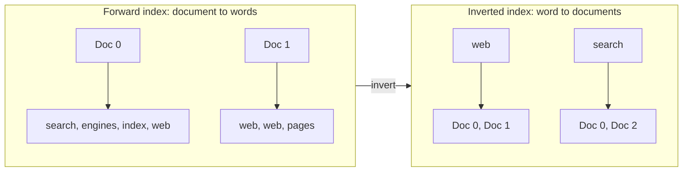
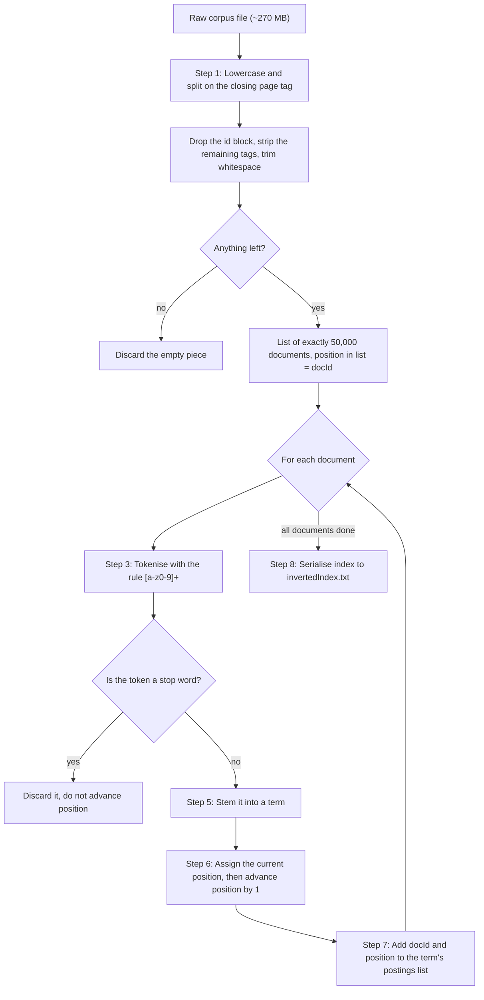
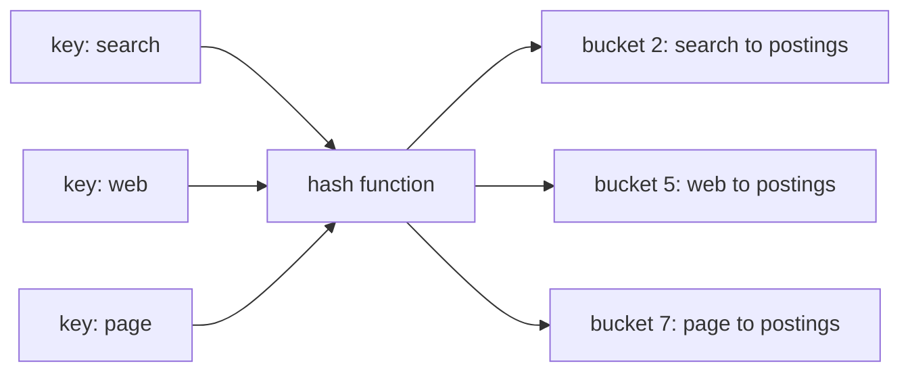
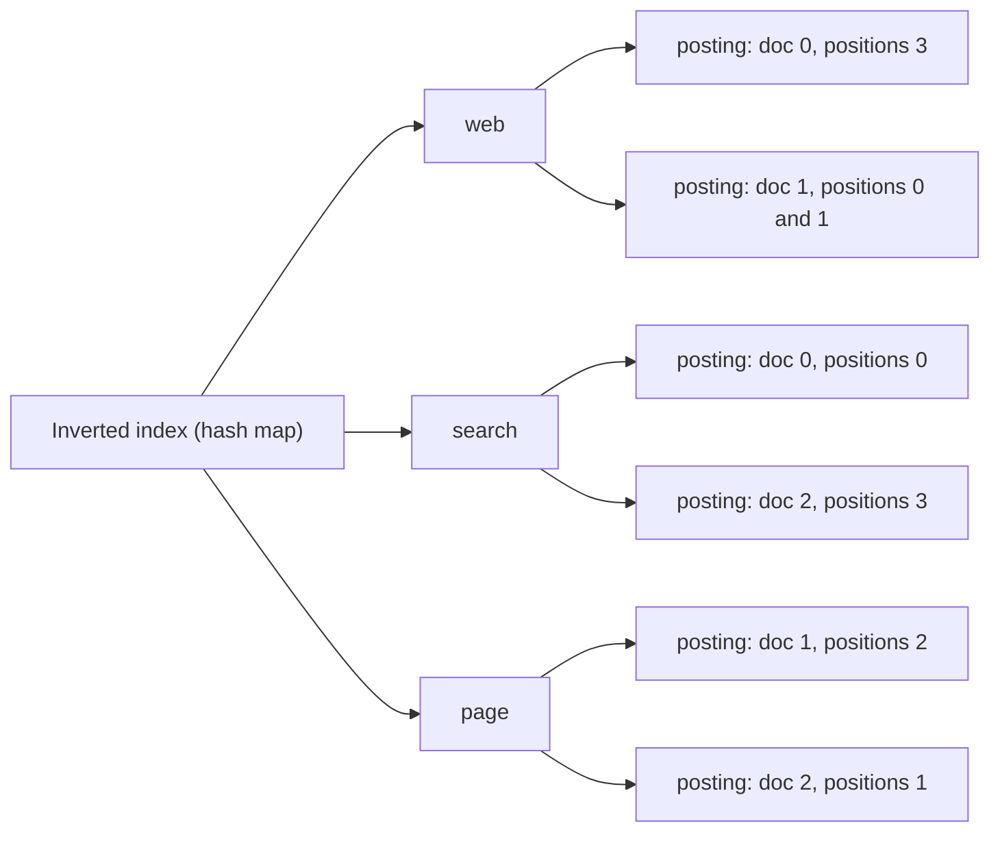
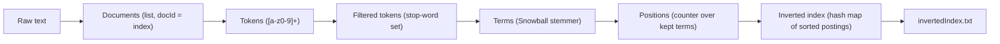

# Building a Search Engine From Scratch — Part 1: The Inverted Index

> *How do you find a needle in 50,000 haystacks in a few milliseconds? You stop searching the haystacks and start searching a map of where the needles are.*

---

## Table of Contents

1. [A Short History of Finding Things](#1-a-short-history-of-finding-things)
2. [Life After Google: Lucene, Elasticsearch and Algolia](#2-life-after-google-lucene-elasticsearch-and-algolia)
3. [What We Are Building in This Series](#3-what-we-are-building-in-this-series)
4. [The Problem: Why Not Just Scan Everything?](#4-the-problem-why-not-just-scan-everything)
5. [The Big Idea: Forward Index vs. Inverted Index](#5-the-big-idea-forward-index-vs-inverted-index)
6. [Our Dataset (Briefly)](#6-our-dataset-briefly)
7. [The Indexing Pipeline at a Glance](#7-the-indexing-pipeline-at-a-glance)
8. [Step 1 — Splitting the Corpus Into Documents](#8-step-1--splitting-the-corpus-into-documents)
9. [Step 2 — Normalisation (Lowercasing)](#9-step-2--normalisation-lowercasing)
10. [Step 3 — Tokenisation](#10-step-3--tokenisation)
11. [Step 4 — Stop Word Removal](#11-step-4--stop-word-removal)
12. [Step 5 — Stemming](#12-step-5--stemming)
13. [Step 6 — Recording Positions](#13-step-6--recording-positions)
14. [Step 7 — Building the Index Itself](#14-step-7--building-the-index-itself)
15. [A Complete Worked Example](#15-a-complete-worked-example)
16. [The Mathematics of an Inverted Index](#16-the-mathematics-of-an-inverted-index)
17. [Step 8 — Writing the Index to Disk](#17-step-8--writing-the-index-to-disk)
18. [What Our Real Index Looks Like](#18-what-our-real-index-looks-like)
19. [Implementing This in Your Language of Choice](#19-implementing-this-in-your-language-of-choice)
20. [Engineering Notes, Trade-offs and Known Limitations](#20-engineering-notes-trade-offs-and-known-limitations)
21. [Recap and What's Next](#21-recap-and-whats-next)
22. [References and Further Reading](#22-references-and-further-reading)

---

## 1. A Short History of Finding Things

Every day, billions of people type a few words into a box and, in well under a second, get back a ranked list of relevant pages pulled from an index of an almost incomprehensible size. It feels like magic. It isn't. It is a handful of beautifully simple ideas, refined over decades, stacked on top of each other. This series is about rebuilding those ideas ourselves, one layer at a time.

But before we write a single line of logic, it is worth knowing where those ideas came from.

### Before the Web: Archie (1990)

The first tool widely recognised as an Internet search engine was **Archie**, created in 1990 by **Alan Emtage**, then a student at **McGill University** in Montreal (with Bill Heelan and Peter Deutsch). Archie predates the World Wide Web. It periodically downloaded the file listings of public FTP servers and let you search those *file names*. It did not know what was *inside* the files — only what they were called. Still, the core idea was already there: **do the expensive work of collecting information ahead of time, so that answering a question later is cheap.**

### The Early Web: Directories and Crawlers (1994–1996)

When the Web exploded in the mid-1990s, two very different approaches emerged:

| Approach | Example | How it worked | Weakness |
|---|---|---|---|
| **Human-curated directory** | Yahoo! (1994, started by Stanford students Jerry Yang and David Filo) | People manually categorised websites into a hierarchy | Could not keep up with the growth of the Web |
| **Automated crawler + full-text index** | WebCrawler (1994), Lycos (1994), AltaVista (1995) | Software "spiders" downloaded pages and indexed every word | Ranking was mostly based on *what words a page contained*, which was easy to game |

Full-text engines like AltaVista were technically impressive — they could tell you *which* pages contained your words. The problem was *ordering*. If a page wanted to rank for "cheap flights", it could simply repeat "cheap flights" hundreds of times, sometimes in invisible text. Relevance based purely on a page's own content trusted the page to be honest about itself. Pages were not honest.

### Stanford, BackRub and PageRank (1996–1998)

In 1996, **Larry Page**, a PhD student in computer science at **Stanford University**, started a research project to study the link structure of the Web. He was soon joined by fellow PhD student **Sergey Brin**. The project was part of the **Stanford Digital Library Project**, and it was nicknamed **"BackRub"** because its central object of study was *backlinks* — the links pointing *into* a page.

The insight was borrowed from academia: a research paper is considered important if many other papers cite it, and *especially* if important papers cite it. Page and Brin applied the same reasoning to the Web: a link from page A to page B is a vote by A for B. Votes from pages that themselves receive many votes count for more.

That idea became **PageRank**. In the 1998 paper *"The Anatomy of a Large-Scale Hypertextual Web Search Engine"*, Brin and Page wrote it as:

$$
PR(A) = (1 - d) + d \left( \frac{PR(T_1)}{C(T_1)} + \frac{PR(T_2)}{C(T_2)} + \dots + \frac{PR(T_n)}{C(T_n)} \right)
$$

Where:

| Symbol | Meaning |
|---|---|
| $PR(A)$ | The PageRank of page $A$ |
| $T_1 \dots T_n$ | The pages that link **to** $A$ |
| $C(T_i)$ | The number of links going **out** of page $T_i$ |
| $d$ | A "damping factor" between 0 and 1, which the paper says is usually set to **0.85** |

There's a lovely intuition behind it called the **random surfer model**: imagine someone clicking links at random forever, occasionally getting bored and jumping to a completely random page (that's the $1-d$ part). A page's PageRank is roughly the probability that this surfer is on it at any given moment. A page linked from many important pages gets visited a lot. A spam page that nobody links to does not — no matter how many times it repeats "cheap flights".

The algorithm was formally described in the Stanford technical report *"The PageRank Citation Ranking: Bringing Order to the Web"* by **Larry Page, Sergey Brin, Rajeev Motwani and Terry Winograd**. Motwani and Winograd were Stanford faculty, and **Hector Garcia-Molina**, who led work in the Digital Library Project, was also a key academic mentor. Engineer **Scott Hassan** wrote much of the early code for the research prototype. Like most great systems, it was a team effort.

The research prototype was renamed **Google** — a play on *googol*, the number $10^{100}$, signalling the ambition to organise an enormous amount of information. It ran at `google.stanford.edu`, and by the time the *Anatomy* paper was published, its database contained **at least 24 million web pages**.

In August 1998, **Andy Bechtolsheim**, co-founder of Sun Microsystems, saw a demo and wrote a **$100,000 cheque to "Google Inc."** — a company that did not legally exist yet. Page and Brin incorporated it on **September 4, 1998**, working out of a rented garage in Menlo Park. The rest you know.

### The Part of the Story Most People Skip

Here is the detail that matters for *us*. PageRank decides the **order** of results. But before you can order anything, you need to find *which* of your 24 million pages contain the words "stanford university" at all — and you need to do that in milliseconds.

If you read the *Anatomy* paper, a large portion of it is not about PageRank at all. It's about **data structures**: a *lexicon* of words, *hit lists* recording every occurrence of every word in every document (including the word's **position**), a *forward index*, and — the star of today's post — an **inverted index**, built by sorting the forward index by word.

PageRank made Google *good*. The inverted index made it *possible*.

---

## 2. Life After Google: Lucene, Elasticsearch and Algolia

Web search is the most visible kind of search, but it's far from the only one. Every time you search your email, filter products on an e-commerce site, look up a log line in a monitoring dashboard, or hit `Ctrl+K` on a documentation site, a search engine is running. Most of those search engines don't crawl the Web — they index a company's *own* data. But underneath, they play the same game.

### Apache Lucene (1999)

In 1999, **Doug Cutting** — who had previously worked on search at Xerox PARC, Apple and Excite — wrote **Lucene**, a full-text search *library* in Java, and released it as open source. (The name is his wife's middle name.) Lucene joined the **Apache Software Foundation** in 2001 and became a top-level Apache project in 2005. Cutting would later go on to co-create **Nutch** and **Hadoop**.

Lucene is not a server or a product — it's the engine block. At its heart is, unsurprisingly, an inverted index, stored in immutable files called *segments* that are periodically merged together. Lucene powers an astonishing amount of the world's search, mostly indirectly, through the systems built on top of it: **Apache Solr**, **Elasticsearch** and **OpenSearch**.

### Elasticsearch (2010)

**Shay Banon** started playing with an early version of Lucene while living in London, building a recipe search engine for his wife, who was attending culinary school. That experiment grew into an open-source project called **Compass**, which made Lucene easier to use from Java applications. Realising that the world needed something distributed and scalable, he rewrote it from scratch, and in **2010** released **Elasticsearch**: Lucene wrapped in a distributed server, spoken to over HTTP with JSON. Its company, now **Elastic**, built the well-known "ELK" stack (Elasticsearch, Logstash, Kibana). Every shard of an Elasticsearch cluster is — you guessed it — a Lucene index, which is an inverted index.

### Algolia (2012)

**Algolia** was founded in 2012 in Paris by **Nicolas Dessaigne** and **Julien Lemoine**. They initially built an *offline search engine SDK for mobile apps*, where speed and tiny memory footprints were non-negotiable. The market for offline mobile search proved small, so — around the time they went through **Y Combinator** (Winter 2014 batch) — they pivoted to a hosted **search-as-a-service API**, bringing that obsession with speed and instant "search-as-you-type" relevance to websites and apps. Different business, different engine (they built their own rather than using Lucene), same foundational idea.

### The Common Thread

| System | Year | Domain | Core retrieval data structure |
|---|---|---|---|
| Archie | 1990 | FTP file names | Searchable index of file names |
| Google (prototype) | 1996–1998 | The Web | Inverted index + PageRank |
| Apache Lucene | 1999 | Any text (library) | Inverted index (segments) |
| Elasticsearch | 2010 | Any text (distributed server) | Lucene inverted indexes, sharded |
| Algolia | 2012 | Websites & apps (hosted API) | Custom inverted-index-based engine |

Fifty years of progress in ranking, distribution, typo-tolerance and machine learning — and the inverted index is still there, quietly doing the heavy lifting. That's what we're going to build today.

---

## 3. What We Are Building in This Series

By the end of this series you'll have built a working search engine from first principles. No search libraries, no databases, no magic.


A few ground rules for how this series is written:

- **Language-agnostic.** Our reference implementation is in Python, but this post contains **no code snippets**. Instead, we explain every step in terms of **data structures, algorithms and a bit of maths**, so you can implement it in Python, JavaScript, Go, Java, C#, Rust, C++ — whatever you're comfortable with.
- **Beginner-friendly.** If you've never heard of a hash map, that's fine. We'll explain every structure as we meet it.
- **Implementation-focused.** We're here to understand how a search engine *actually works inside*. We'll keep document parsing deliberately simple for now and give it the attention it deserves in a later post.

---

## 4. The Problem: Why Not Just Scan Everything?

Our dataset is a single text file of about **270 MB** containing **50,000 Wikipedia articles**. Suppose a user searches for `quantum`.

The most obvious approach is: open the file, read every article from top to bottom, and collect the ones that contain the word "quantum". This is called a **linear scan**, and it's what a "find" feature in a text editor does.

It works. It's also terrible for a search engine:

| | Linear scan | Inverted index |
|---|---|---|
| Work done per query | Read **all** 270 MB, every single time | Look up one entry, read a short list |
| Cost grows with... | Total size of the collection | Number of documents that actually *match* |
| 1,000 queries cost | 1,000 × 270 MB of scanning | 1,000 cheap lookups |
| Scales to the Web? | Absolutely not | Yes — that's how it's done |

Think about a printed textbook. If you want to find every page that mentions "photosynthesis", you don't read the book cover to cover. You flip to the **index at the back**, find "photosynthesis — pages 45, 112, 230", and go straight there.

Someone did the hard work *once*, when the book was printed, so that every reader could find things *instantly*. That's precisely the trade an inverted index makes:

> **Spend a lot of time and memory up-front (indexing) so that every future question (query) is cheap.**

---

## 5. The Big Idea: Forward Index vs. Inverted Index

The way documents naturally exist is as a mapping from **document → words**. This is called a **forward index**:

| Document | Words it contains |
|---|---|
| Doc 0 | search, engines, index, web |
| Doc 1 | web, web, pages |
| Doc 2 | indexing, pages, searching, fast |

That's great if your question is *"what words are in Doc 1?"*. But a search engine's question is the opposite: *"which documents contain the word **web**?"*. To answer that with a forward index you'd have to check every row — the linear scan again.

So we flip ("invert") the table, mapping **word → documents**:

| Word | Documents that contain it |
|---|---|
| search | Doc 0, Doc 2 |
| web | Doc 0, Doc 1 |
| pages | Doc 1, Doc 2 |
| ... | ... |

That's an **inverted index**. Now answering *"which documents contain web?"* is a single lookup.



### Some vocabulary we'll use from now on

Information retrieval has its own jargon. It's worth learning because you'll see it in every paper and every search engine's documentation.

| Term | Meaning | Example |
|---|---|---|
| **Corpus** / **collection** | The full set of documents we're searching | Our 50,000 Wikipedia articles |
| **Document** | One unit of retrieval — the thing we return as a result | One Wikipedia article |
| **Document ID (docId)** | A unique integer that identifies a document | `0`, `1`, `2`, ... |
| **Token** | A raw chunk of text cut out of a document | `"Searching"` |
| **Term** | A token after cleaning it up (lowercased, stemmed). Terms are what we actually index | `"search"` |
| **Vocabulary** / **lexicon** / **dictionary** | The set of all distinct terms in the corpus | 500,824 terms in our case |
| **Posting** | One record saying "this term appears in this document (at these positions)" | `(doc 2, positions [3])` |
| **Postings list** | All the postings for one term, in docId order | `search → [(0,[0]), (2,[3])]` |

Our index is a **positional inverted index**, meaning each posting stores not just *which* documents contain the term, but *exactly where* inside the document it appears. We'll see why that matters shortly.

---

## 6. Our Dataset (Briefly)

We use a single file, `wikipedia_50000.txt` (~270 MB), containing **50,000 English Wikipedia articles**, already compiled together for simplicity. Each article is wrapped in simple XML-style tags:

| Tag | Contains | Example |
|---|---|---|
| `<page> ... </page>` | One whole article | — |
| `<id> ... </id>` | Wikipedia's ID for the article (we discard it) | `12` |
| `<title> ... </title>` | The article's title | `Anarchism` |
| `<text> ... </text>` | The article's body | `Anarchism is a political philosophy and movement that...` |

That's all we need to know for now. **Organising and parsing real-world documents (HTML, metadata, deduplication, fields, etc.) is a deep topic of its own and will get its own post later in the series.** Today our parsing is intentionally minimal, so we can focus on the engine.

---

## 7. The Indexing Pipeline at a Glance

Here is the complete journey from raw text file to finished index. Every box is a section below.



Two functions in our reference implementation do all of this:

| Function | Responsibility |
|---|---|
| `parseDoc` | Lowercases the entire corpus, splits it into individual articles, drops the `<id>` block, strips the tags and discards empty pieces |
| `createInvertedIndex` | Tokenises, removes stop words, stems, tracks positions and builds the index |

And an orchestrating `main` function reads the file, calls those two in order and writes the result to disk.

---

## 8. Step 1 — Splitting the Corpus Into Documents

Our corpus is one giant string. We need to turn it into a **list of documents**.

### What happens

1. **Read the whole file into memory** as a single string of text.
2. **Lowercase everything** (more on why in the next section).
3. **Split** the big string every time the closing tag `</page>` appears. Each resulting piece is (potentially) one article.
4. **Remove the `<id>` tag *together with its value*.** Wikipedia's page IDs (like `12`) are essentially arbitrary numbers. Nobody searches for them and we don't use them anywhere, so we throw away the whole `<id> ... </id>` block instead of letting the number leak into the text as if it were a word.
5. **Remove the remaining tags** (`<page>`, `<title>`, `</title>`, `<text>`, `</text>`) by replacing each of them with nothing. The title and body text simply merge together into one stream of text.
6. **Trim and filter.** Strip leading and trailing whitespace from each piece, and **keep it only if something is left**. Empty pieces are discarded.

Why step 6? Splitting creates a piece for *everything after* each separator, including whatever comes after the very last `</page>`. Our file ends with a newline after the final `</page>`, so a naive split produces 50,001 pieces: 50,000 articles plus one piece containing nothing but whitespace. That ghost document would claim a document ID of its own and quietly inflate our document count, distorting any statistic that depends on $N$ (the number of documents) later in the series. Filtering out empty pieces guarantees **exactly one list entry per real article**.

| Raw split piece | After cleaning | Kept? |
|---|---|---|
| `<page> <id> 12 </id> <title> Anarchism </title> <text> Anarchism is ... </text>` | `anarchism  anarchism is ...` | ✅ |
| `<page> <id> 39 </id> <title> Albedo </title> <text> Albedo (; ) is ... </text>` | `albedo  albedo (; ) is ...` | ✅ |
| ... | ... | ✅ |
| *(only the final newline)* | *(empty)* | ❌ discarded |

The result is an ordered **list** (also called an **array**) of exactly 50,000 strings:

| Index in list | Contents (truncated) |
|---|---|
| 0 | `anarchism  anarchism is a political philosophy and movement ...` |
| 1 | `albedo  albedo (; ) is the fraction of sunlight that is diffusely reflected ...` |
| 2 | `...` |
| ... | ... |
| 49,999 | `... produced by warryn campbell` |

### The data structure: a list (array)

A **list** is an ordered sequence of items stored one after another, where each item is reachable by its **index** — its position in the sequence, counted from **0**. Looking up item number *i* takes the same tiny amount of time no matter how long the list is. In computer science we write this as **O(1)** ("order one", or constant time).

### Document IDs come for free

Notice something elegant: we don't need to invent IDs for our documents. **A document's position in this list *is* its ID.** The first article (Anarchism) is document `0`, the next is document `1`, and so on. Later, when the index tells us "the term appears in document 4,217", we can fetch that document instantly by going to index 4,217 of the list.

> **Why integers?** Integers are small, cheap to compare and cheap to sort. Every real search engine maps documents to compact integer IDs internally, even if the documents have URLs or string keys externally.

> **Why our own IDs and not Wikipedia's?** Wikipedia's page IDs are sparse and arbitrary (`12`, `39`, ...). Our list positions are dense (`0, 1, 2, ...`), so a document ID can be used directly as an index into the list, with no extra lookup table.

---

## 9. Step 2 — Normalisation (Lowercasing)

Computers compare text character by character, and to a computer `"Google"`, `"google"` and `"GOOGLE"` are three completely different strings. A user searching for `google` would not find a document that only says `Google`.

So before anything else, we **convert all text to lowercase**. This is the simplest form of **normalisation**: transforming text so that things a human considers "the same word" actually look the same to the machine.

| Original | After lowercasing |
|---|---|
| `Anarchism` | `anarchism` |
| `Stanford University` | `stanford university` |
| `NASA` | `nasa` |

The golden rule of normalisation: **whatever you do to the documents at indexing time, you must do to the query at search time.** If we lowercase the documents but not the query, a search for `Google` would never match anything. We'll come back to this rule in Part 2.

> **Trade-off:** lowercasing loses some information. "Apple" (the company) and "apple" (the fruit) become indistinguishable. Nearly every search engine accepts this trade, because it helps far more queries than it hurts.

---

## 10. Step 3 — Tokenisation

Now we have documents as long strings of lowercase text. But we don't index *strings*, we index *words*. **Tokenisation** is the process of chopping a stream of text into individual units called **tokens**.

### Our tokenisation rule

We use one simple, precise rule:

> **A token is any unbroken run of the characters `a`–`z` and `0`–`9`. Any other character (space, punctuation, hyphen, bracket, symbol, accented letter...) acts as a separator.**

In regular-expression notation, this rule is written `[a-z0-9]+`, which reads as "*one or more* characters, each of which is in the range a–z or 0–9". Every programming language has a regular-expression engine that can find all matches of this pattern in a string, one after another. (If you'd rather not use regular expressions, you can implement the same rule by walking through the string one character at a time: keep appending characters to the current token while they're alphanumeric, and "close" the token whenever you hit any other character.)

### Examples

| Input text | Tokens produced | Notes |
|---|---|---|
| `apple+orange` | `apple`, `orange` | `+` is a separator |
| `nation-states` | `nation`, `states` | Hyphens split words |
| `pierre-joseph proudhon (1809–1865)` | `pierre`, `joseph`, `proudhon`, `1809`, `1865` | Brackets and dashes are separators; numbers are kept |
| `don't` | `don`, `t` | Apostrophes split, too. A known limitation of simple tokenisers |
| `e-mail` | `e`, `mail` | Same story |
| `café` | `caf` | `é` is not in `a–z`, so it acts as a separator. Non-English text is a whole topic of its own |

### Why such a simple rule?

Because it's **predictable**, **fast** and **easy to replicate exactly** at query time. Tokenisation is a surprisingly deep rabbit hole (think URLs, email addresses, "C++", "U.S.A.", Chinese text with no spaces at all...), and production engines like Lucene ship with many configurable tokenisers. For learning the core of a search engine, a simple rule applied consistently beats a clever rule applied inconsistently.

---

## 11. Step 4 — Stop Word Removal

Some words are everywhere. "the", "of", "and", "is", "to" appear in virtually every English document. A list of documents containing "the" is essentially a list of *all* documents — it tells us nothing useful, and it would be by far the largest entry in our index.

This is not a coincidence; it's a well-known statistical property of language called **Zipf's law**: in a large body of text, a word's frequency is roughly inversely proportional to its rank. The most common word appears about twice as often as the second most common, three times as often as the third, and so on. A tiny number of words account for a huge fraction of all the text.

Words that are extremely frequent but carry little meaning are called **stop words**, and we **discard** them before indexing.

### Our stop word list

We use a small, hand-picked list of **40** common English words:

| | | | | | | | |
|---|---|---|---|---|---|---|---|
| a | an | the | by | is | they | that | them |
| for | are | and | in | was | were | but | as |
| with | of | to | it | on | at | this | or |
| from | which | not | be | have | has | had | will |
| would | shall | should | may | might | must | can | could |

### The data structure: a set

For every single token in all 50,000 documents (tens of millions of tokens), we have to ask: *"is this a stop word?"*. If we stored the stop words in a plain list, answering that would mean comparing the token against each of the 40 words one by one. That's 40 comparisons, tens of millions of times.

Instead we store them in a **set**. A set is a collection of unique items that is optimised for one question: *"is X in here?"*. Under the hood, most languages implement sets using **hashing** (explained properly in Step 7), which lets us answer the membership question in **O(1)** time on average — roughly the same cost whether the set holds 40 words or 40,000.

| Structure | Cost to check "is `the` a stop word?" |
|---|---|
| List of 40 words | Up to 40 comparisons → **O(n)** |
| Set of 40 words | About 1 hash computation + 1 comparison → **O(1)** on average |

### The trade-off

Removing stop words makes the index smaller and faster. But it isn't free. The famous line *"to be or not to be"* consists **entirely** of words on our stop list — after removal, nothing is left to search for! Modern web search engines often keep stop words for exactly this reason, and handle their cost with smarter techniques. For our engine, removing them is the right call: it's simpler and keeps our index lean.

---

## 12. Step 5 — Stemming

Consider a user searching for `connection`. Should a document that says "connected" match? What about "connecting"? Almost certainly yes — they're all about the same idea. But to a computer, they're different strings.

**Stemming** is the process of chopping words down to a common root form, called a **stem**, by stripping suffixes like *-ing*, *-ed*, *-s*, *-ion*, *-ism*, and so on.

### The algorithm we use

The classic stemming algorithm is the **Porter stemmer**, published by **Martin Porter** in 1980. It's a sequence of carefully ordered rules, applied in steps, of the form *"if the word ends in X, and what's left meets condition Y, replace X with Z"*.

Our implementation uses the **Snowball English stemmer** (via the PyStemmer library), commonly known as **"Porter2"** — Martin Porter's own improved revision of his original algorithm. Snowball stemmers are available for practically every language, so whatever language you implement this in, you can find a compatible English Snowball/Porter2 stemmer, or implement it yourself from the published rules.

### Real examples from our stemmer

These are actual outputs from the stemmer used in our implementation:

| Original words | Stem | |
|---|---|---|
| connection, connected, connecting | `connect` | ✅ All variations unified |
| search, searching | `search` | ✅ |
| index, indexing, indexed | `index` | ✅ |
| engine, engines | `engin` | ✅ Note: not a real English word! |
| fish, fishes, fishing, fished | `fish` | ✅ |
| running, runs | `run` | ✅ |
| anarchism | `anarch` | |
| anarchist, anarchists | `anarchist` | ⚠️ Not merged with `anarch` |
| political | `polit` | |
| philosophy | `philosophi` | |
| university | `universiti` | |
| universe | `univers` | ✅ Correctly kept separate from "university" |
| fisher | `fisher` | ⚠️ Not reduced to `fish` |
| ran | `ran` | ⚠️ Irregular verb, not reduced to `run` |

### Things worth noticing

1. **Stems don't have to be real words.** `engin`, `polit` and `philosophi` aren't English. That's fine — users never see stems. They only need to be **consistent**: every form of "engine" produces `engin`, both in documents and in queries.
2. **Stemming is rule-based, not "intelligent".** It doesn't know that "ran" is the past tense of "run". Reducing words to their dictionary form using actual linguistic knowledge is called **lemmatisation**, and it's slower and more complex.
3. **There are two kinds of mistakes.** *Over-stemming* merges words that shouldn't be merged; *under-stemming* fails to merge words that should be (like `anarch` vs. `anarchist` above). Every stemmer is a balance between the two.

After stemming, our token has become a **term** — the unit that actually goes into the index.

---

## 13. Step 6 — Recording Positions

We could stop here and build an index that only records *which documents* contain each term. That would be enough for queries like "find documents containing **stanford** and **university**". But it can't tell the difference between:

- *"...he attended **Stanford University** in California..."*
- *"...the **university** sent a delegation to the **Stanford** linear accelerator..."*

Both contain both words. Only the first contains the **phrase** "stanford university". To support phrase queries, we need to know **where** in each document each term appears. So for every term we keep, we record its **position**.

### How positions are counted

We keep a counter for each document, starting at **0**. Every time we **keep** a token (i.e. it's not a stop word), we record the counter's current value as that token's position, then add 1 to the counter.

Crucially: **stop words do not advance the counter.** Positions count *meaningful terms only*.

Let's see what that means on the sentence *"The University of Stanford is in California"*:

| Token | Stop word? | Term (after stemming) | Position assigned | Counter after |
|---|---|---|---|---|
| the | yes | — | — | 0 |
| university | no | `universiti` | **0** | 1 |
| of | yes | — | — | 1 |
| stanford | no | `stanford` | **1** | 2 |
| is | yes | — | — | 2 |
| in | yes | — | — | 2 |
| california | no | `california` | **2** | 3 |

Because "of" was skipped, `universiti` (position 0) and `stanford` (position 1) are now **adjacent**. A query for "university of stanford" goes through the same pipeline at search time, becomes `universiti stanford`, and can be matched by checking for consecutive positions. This is a deliberate and very practical design choice — and it's exactly the kind of consistency that makes Part 2 work.

This idea isn't new, by the way. The original Google prototype stored "hit lists" for every word in every document, and each hit recorded the word's position (along with things like font size and capitalisation).

---

## 14. Step 7 — Building the Index Itself

Now for the main event. We have a stream of `(term, docId, position)` facts coming out of the pipeline. We need to organise them so that, given a term, we can instantly get every document and position where it appears.

### The data structure: a hash map

A **hash map** (also called a *hash table*, *dictionary*, *map* or *associative array* depending on your language) stores **key → value** pairs and lets you find the value for a given key in **O(1)** time on average.

Here's how it works, conceptually:

1. The map holds an internal array of "buckets".
2. When you store a key, a **hash function** turns the key (e.g. the string `"search"`) into a big number.
3. That number, reduced to the size of the array (using the remainder after division, *modulo*), tells the map **which bucket** to put the pair in.
4. To look up a key later, the map computes the same hash, jumps straight to that bucket, and finds the pair — without looking at any other buckets.



Two different keys occasionally land in the same bucket (a **collision**); hash maps handle that internally, so on average a lookup still costs roughly the same regardless of whether the map holds 10 keys or 548,800. That's exactly what we need for a vocabulary of over half a million terms.

### The shape of our index

Our inverted index is a **hash map of lists of pairs**:

- **Key:** a term (string), e.g. `"web"`
- **Value:** a **postings list** — a list of postings, sorted by docId
- **Posting:** a pair of `(docId, list of positions)`, positions sorted ascending

Written out, the entry for `web` in our small example looks like this:

```text
"web"  →  [ (0, [3]),  (1, [0, 1]) ]
            │   │       │   └── positions inside doc 1
            │   │       └────── docId 1
            │   └────────────── positions inside doc 0
            └────────────────── docId 0
```

Or as a nested structure diagram:



### The insertion algorithm

For every kept term at position `pos` in document `docId`, we do the following:

1. **Is this term new?** Look it up in the hash map. If it isn't there, create an entry for it with an **empty postings list**.
2. **Is this the first time we've seen this term *in this document*?** Look at the **last** posting in the term's postings list:
   - If the list is empty, **or** the last posting belongs to a *different* document → append a **new posting** `(docId, [pos])`.
   - Otherwise (the last posting is for the *current* document) → simply **append `pos`** to that posting's positions list.
3. Advance the position counter by one.

### The clever bit: why only check the *last* posting?

This is the most important engineering insight in the whole indexer, so let's slow down.

We process documents **in order**: all of document 0, then all of document 1, then document 2, and so on. That means:

- Any posting for the *current* document can only have been created during the *current* document's processing, so if it exists, **it must be the last one in the list**.
- Every posting in the list belongs to a document we've **already finished** or the one we're on — so docIds in each postings list are automatically in **increasing order**.
- Within a document, positions are handed out in increasing order, so each positions list is also automatically **sorted**.

So with a single O(1) check of the last element, we get two big wins:

| Win | Why it matters |
|---|---|
| **No searching inside postings lists** | Each insertion is O(1) on average, regardless of how many documents a term appears in. The term `engin` appears in 4,563 documents; we never scan through them |
| **Sorted postings for free** | Sorted postings lists can be intersected and merged extremely efficiently — which is exactly what query processing needs in Part 2. We never have to run a sorting step |

This is a **single-pass** algorithm: we read every token exactly once, and when we're done, the index is complete and sorted.

---

## 15. A Complete Worked Example

Let's trace the whole pipeline by hand on a tiny corpus of three documents. Do this once with pen and paper and you'll understand inverted indexes better than most people who use them every day.

### The corpus

| docId | Text |
|---|---|
| 0 | *"Search engines index the web."* |
| 1 | *"The web is a web of pages."* |
| 2 | *"Indexing pages makes searching fast."* |

### Steps 2–6, for every document

**Document 0:** `search engines index the web`

| Token | Stop word? | Term | Position |
|---|---|---|---|
| search | no | `search` | 0 |
| engines | no | `engin` | 1 |
| index | no | `index` | 2 |
| the | **yes** | — | — |
| web | no | `web` | 3 |

**Document 1:** `the web is a web of pages`

| Token | Stop word? | Term | Position |
|---|---|---|---|
| the | **yes** | — | — |
| web | no | `web` | 0 |
| is | **yes** | — | — |
| a | **yes** | — | — |
| web | no | `web` | 1 |
| of | **yes** | — | — |
| pages | no | `page` | 2 |

**Document 2:** `indexing pages makes searching fast`

| Token | Stop word? | Term | Position |
|---|---|---|---|
| indexing | no | `index` | 0 |
| pages | no | `page` | 1 |
| makes | no | `make` | 2 |
| searching | no | `search` | 3 |
| fast | no | `fast` | 4 |

### Step 7, watching the index grow

**After document 0** — four new terms, each gets its first posting:

| Term | Postings list |
|---|---|
| search | (0, [0]) |
| engin | (0, [1]) |
| index | (0, [2]) |
| web | (0, [3]) |

**After document 1** — the first `web` (position 0): the last posting of `web` is for doc 0 ≠ doc 1, so we append a **new** posting. The second `web` (position 1): the last posting is now for doc 1 = current doc, so we just **add the position**. `page` is new.

| Term | Postings list |
|---|---|
| search | (0, [0]) |
| engin | (0, [1]) |
| index | (0, [2]) |
| web | (0, [3]) → (1, **[0, 1]**) |
| page | (1, [2]) |

**After document 2** — `index`, `page` and `search` already exist, so each gets a new posting for doc 2. `make` and `fast` are new.

| Term | Postings list | Document frequency (df) |
|---|---|---|
| search | (0, [0]) → (2, [3]) | 2 |
| engin | (0, [1]) | 1 |
| index | (0, [2]) → (2, [0]) | 2 |
| web | (0, [3]) → (1, [0, 1]) | 2 |
| page | (1, [2]) → (2, [1]) | 2 |
| make | (2, [2]) | 1 |
| fast | (2, [4]) | 1 |

### Using what we built (a sneak peek)

- *"Which documents mention searching?"* → normalise and stem the query to `search` → look it up → **docs 0 and 2**. Notice that doc 2 matched even though it says "searching", not "search". That's stemming paying off.
- *"Which documents contain **both** index and page?"* → `index` is in {0, 2}, `page` is in {1, 2} → the intersection is **doc 2**.
- *"Which documents contain the phrase **index pages**?"* → in doc 2, `index` is at position 0 and `page` is at position 1 — consecutive. **Match.**

We'll implement all of this properly in Part 2.

---

## 16. The Mathematics of an Inverted Index

You don't need maths to build an index, but describing it formally makes the design crystal clear, and the quantities we define here are the building blocks of ranking later in the series.

### Definitions

Let:

- $D = \{d_0, d_1, \dots, d_{N-1}\}$ be the collection of $N$ documents, where each $d_j$ is identified by the integer $j$.
- Each document, after the pipeline (tokenise → remove stop words → stem), becomes a **sequence of terms**: $d_j = (t_{j,0},\ t_{j,1},\ \dots,\ t_{j,L_j - 1})$, where $L_j$ is the number of kept terms in document $j$.
- $V$ (the **vocabulary**) be the set of all distinct terms across all documents.

Then the positional inverted index is a **function** that maps every term to its occurrences:

$$
I : V \rightarrow \text{postings}
$$

$$
I(t) = \Big[\, \big(j,\ P_{t,j}\big) \ \Big|\ P_{t,j} \neq \varnothing \,\Big] \quad \text{sorted by } j
$$

where the **position set** of term $t$ in document $j$ is:

$$
P_{t,j} = \{\, p \mid t_{j,p} = t \,\}
$$

In words: "the positions $p$ in document $j$ where the term at position $p$ is $t$". The postings list for $t$ contains one entry for every document where that set is not empty.

### Useful quantities you get for free

| Quantity | Formula | Meaning | From our worked example |
|---|---|---|---|
| **Term frequency** $tf_{t,j}$ | $\lvert P_{t,j} \rvert$ | How many times term $t$ appears in doc $j$ (length of the positions list) | $tf_{\text{web},1} = 2$ |
| **Document frequency** $df_t$ | $\lvert I(t) \rvert$ | How many documents contain $t$ (length of the postings list) | $df_{\text{web}} = 2$ |
| **Collection frequency** $cf_t$ | $\sum_j tf_{t,j}$ | Total occurrences of $t$ in the whole corpus | $cf_{\text{web}} = 3$ |
| **Vocabulary size** | $\lvert V \rvert$ | Number of distinct terms | 7 |
| **Document length** | $L_j$ | Number of kept terms in document $j$ | $L_2 = 5$ |

Keep an eye on $tf$ and $df$. Intuitively, a term that appears *often in a document* (high $tf$) but in *few documents overall* (low $df$) is a strong signal of what that document is about. That intuition is the basis of classic relevance scoring, and our index already contains everything needed to compute it.

### Invariants (things that are always true)

A good engineer states the guarantees their data structure provides. Ours guarantees:

1. **Postings are sorted by docId:** in every $I(t)$, docIds strictly increase. *(Because we process documents in order.)*
2. **Positions are sorted:** every $P_{t,j}$ is in strictly increasing order. *(Because the position counter only goes up.)*
3. **No duplicate documents:** each docId appears at most once in a postings list. *(Because of the "check the last posting" rule.)*
4. **Positions are dense over kept terms:** in each document, the positions $0, 1, \dots, L_j - 1$ are each used by exactly one term. *(Because stop words don't advance the counter.)*

### Complexity

Let $T$ be the total number of tokens in the corpus (before stop word removal).

| Resource | Cost | Why |
|---|---|---|
| **Time** | $O(T)$ on average | Each token is touched once: one set lookup, one stem, one hash map lookup, one O(1) append. Stemming a word costs time proportional to its length, which is small and bounded in practice |
| **Space** | $O(\lvert V \rvert + \sum_t cf_t)$ | One entry per distinct term, plus one stored integer per kept term occurrence (its position), plus one docId per posting |

The space formula reveals an important truth: **a positional index stores roughly one number for every meaningful word in the corpus**. That's why positional indexes are big — as we'll see in a moment.

---

## 17. Step 8 — Writing the Index to Disk

So far, the index lives in memory (RAM). The moment the program exits, it's gone. Building it takes a while, so we don't want to rebuild it every time someone wants to search. We **serialise** it — convert it into a flat text format — and save it to a file called `invertedIndex.txt`. The query program (Part 2) will load it back.

### The file format

One line per term, in this shape:

```text
term|docId:pos,pos,pos;docId:pos,pos;docId:pos
```

| Delimiter | Separates |
|---|---|
| `\|` (pipe) | The term from its postings list |
| `;` (semicolon) | One posting from the next |
| `:` (colon) | A docId from its positions |
| `,` (comma) | One position from the next |
| newline | One term from the next |

Our worked example would be written as:

```text
search|0:0;2:3
engin|0:1
index|0:2;2:0
web|0:3;1:0,1
page|1:2;2:1
make|2:2
fast|2:4
```

### Why this format is safe

Here's a subtle point that's easy to miss. Using `|`, `;`, `:` and `,` as delimiters only works if **none of those characters can ever appear inside a term or a number**. Normally you'd have to worry about "escaping" them. But remember our tokenisation rule: terms are made **only** of `a–z` and `0–9`. Our tokeniser already guarantees that delimiters never appear in terms, so the format can be read back unambiguously by simply splitting on each delimiter in turn. Earlier design decisions making later ones simpler — that's good engineering.

### Reading it back (preview)

To reconstruct the index in memory, for each line: split once on `|` to get the term and the postings text; split the postings text on `;` to get each posting; split each posting on `:` to get the docId and the positions text; split the positions text on `,` and convert each piece to an integer. We'll do exactly this in Part 2.

---

## 18. What Our Real Index Looks Like

Running the indexer on our full dataset of 50,000 Wikipedia articles produces:

| Metric | Value |
|---|---|
| Documents indexed | 50,000 |
| Input corpus size | ~270 MB |
| Distinct terms (vocabulary size, $\lvert V \rvert$) | **500,824** |
| Output index size (`invertedIndex.txt`) | ~206 MB |

Yes — the index is about **three-quarters the size of the original text**. That's the cost of storing a position for every meaningful word, written out as human-readable digits. (Real engines compress this heavily; see the next section.)

### Some real terms from our index

| Term | Original words it represents | df (docs containing it) | cf (total occurrences) |
|---|---|---|---|
| `engin` | engine, engines, ... | 4,563 | 16,521 |
| `page` | page, pages, ... | 3,429 | 6,292 |
| `search` | search, searching, ... | 1,912 | 4,078 |
| `web` | web | 1,662 | 3,392 |
| `index` | index, indexing, indexed, ... | 1,100 | 2,077 |
| `univers` | universe | 795 | 2,260 |
| `googl` | google, ... | 551 | 1,149 |
| `stanford` | stanford | 438 | 905 |
| `anarch` | anarchism, ... | 53 | 263 |
| `lucen` | lucene | 2 | 2 |

Notice how wildly $df$ varies — from thousands of documents down to just two. Rare terms are the most *discriminating*: searching for `lucen` immediately narrows 50,000 documents down to 2.

### Zooming in on document 0

Document 0 is the Wikipedia article on **Anarchism**. After Step 1 (the `<id>` block removed, tags stripped, text lowercased), it starts like this:

> `anarchism` `anarchism` `is` `a` `political` `philosophy` `and` `movement` `that` `is` `skeptical` ...

Following the pipeline:

| Token | Stop? | Term | Position |
|---|---|---|---|
| anarchism *(the title)* | no | `anarch` | 0 |
| anarchism *(first word of the body)* | no | `anarch` | 1 |
| is | yes | — | — |
| a | yes | — | — |
| political | no | `polit` | 2 |
| philosophy | no | `philosophi` | 3 |
| and | yes | — | — |
| movement | no | `movement` | 4 |
| that | yes | — | — |
| is | yes | — | — |
| skeptical | no | `skeptic` | 5 |

And here are the actual first lines of our generated `invertedIndex.txt` (truncated):

```text
anarch|0:0,1,22,36,80,130,202,223,275,294,...
polit|0:2,40,281,784,808,941,965,1066,...
philosophi|0:3,323,1625,1654,2083,3029,4153;4:3687;5:7619;...
movement|0:4,34,47,92,138,153,395,604,608,...
skeptic|0:5;5:8165;30:2111;77:3627,3652;78:272;...
```

It matches our hand trace exactly. The title and the first word of the body both become `anarch` at positions 0 and 1, `polit` lands at position 2, and so on. The terms appear in the file in the order they were first discovered, because that's the order they were inserted into the hash map.

> **Why removing the IDs mattered:** before we dropped the `<id>` block, every article's Wikipedia ID became a "word" at position 0. Removing the IDs shrank the vocabulary from 548,800 to **500,824** terms, which means about 48,000 terms existed *only* because of page IDs. Numbers that genuinely appear in article text (for example `12`, which still appears in 8,689 documents) are still indexed, just as they should be.

---

## 19. Implementing This in Your Language of Choice

Everything in this post maps onto standard data structures found in every mainstream language:

| Concept | Python | JavaScript / TypeScript | Java | C# | Go | Rust | C++ |
|---|---|---|---|---|---|---|---|
| Ordered list of documents | `list` | `Array` | `ArrayList` | `List<T>` | slice | `Vec` | `std::vector` |
| Stop word set | `set` | `Set` | `HashSet` | `HashSet<T>` | `map[string]struct{}` | `HashSet` | `std::unordered_set` |
| Term → postings map | `dict` | `Map` | `HashMap` | `Dictionary<K,V>` | `map` | `HashMap` | `std::unordered_map` |
| Posting `(docId, positions)` | list / tuple | object / array | small class / record | record / struct | struct | struct / tuple | struct / `std::pair` |
| Tokeniser `[a-z0-9]+` | `re` | `RegExp` | `java.util.regex` | `System.Text.RegularExpressions` | `regexp` | `regex` crate | `std::regex` (or a manual character loop) |
| English stemmer | PyStemmer (Snowball) | Snowball ports on npm | Lucene / Snowball | Snowball ports | Snowball ports | `rust-stemmers` | libstemmer (Snowball's C library) |

### Your checklist

If you implement this yourself, your indexer is correct when:

- [ ] Documents are numbered `0 … N-1` in the order they appear, with exactly one entry per real article (no empty pieces).
- [ ] The `<id>` block is removed entirely, so page IDs never appear as terms.
- [ ] All text is lowercased before tokenising.
- [ ] Tokens are maximal runs of `a–z0–9`; everything else separates.
- [ ] Stop words are dropped **and do not advance the position counter**.
- [ ] Every kept token is stemmed with an English Snowball (Porter2) stemmer.
- [ ] Each postings list is sorted by docId, each positions list is sorted, with no duplicate docIds.
- [ ] The output file uses `term|docId:pos,pos;docId:pos` with one term per line.
- [ ] Running it on the worked example in Section 15 produces exactly the table shown there.

That last item is your unit test. Always test on something small enough to check by hand before you trust a result on 50,000 documents.

---

## 20. Engineering Notes, Trade-offs and Known Limitations

Our indexer is deliberately simple, so it's honest to point out where a production system would do things differently. None of these matter for learning, but all of them matter at scale.

| Area | What we do | What production engines do |
|---|---|---|
| **Memory** | Load the entire 270 MB corpus *and* the entire index into RAM | Build the index in memory-bounded chunks, flush each chunk to disk, then merge them (algorithms known as *BSBI* and *SPIMI*). Lucene's segment model is a version of this idea |
| **Index updates** | Rebuild everything from scratch | Write new documents into new small segments and merge segments in the background |
| **Storage format** | Human-readable text | Compact binary formats with compression |
| **Parallelism** | Single-threaded | Index on many cores and many machines, then combine |
| **Text analysis** | One tokeniser, 40 stop words, one stemmer, English only | Configurable analysers per field and per language |

### A taste of compression

Look at a positions list like `0:0,1,22,36,80,130,202`. Instead of storing each position, we could store the first one as-is and then only the **gaps** between consecutive positions: `0, 1, 21, 14, 44, 50, 72`. The same trick works for docIds in postings lists. Because lists are sorted (thank you, invariants!), gaps are always positive and usually small, and small numbers can be stored in fewer bytes using *variable-length integer encodings*. This is how real engines shrink positional indexes dramatically. Notice how sortedness, which we got for free in Step 7, keeps paying dividends.

### A remaining simplification

- **Titles and bodies are merged.** A word in the title is treated exactly like a word in the body. In a real engine, a match in the title is usually a much stronger signal, so fields are indexed separately.

That's a parsing concern, and it's exactly why parsing gets its own post later in this series. (The two other parsing pitfalls we hit, Wikipedia IDs leaking into the text and the ghost empty document created by splitting, are already handled in Step 1.)

---

## 21. Recap and What's Next

We've covered a lot of ground. Let's zoom out:



What you now know:

1. **Why** search engines don't scan documents at query time, and how the inverted index trades indexing-time work for query-time speed — the same idea that sat at the core of Google's original 1998 architecture and still sits at the heart of Lucene, Elasticsearch and Algolia.
2. **How text becomes terms**: lowercasing, tokenising, removing stop words and stemming — and the golden rule that queries must go through the *exact same* pipeline.
3. **Why positions matter**, and why skipping stop words when counting positions is a deliberate design choice.
4. **How the index is structured**: a hash map from terms to postings lists of `(docId, positions)` pairs.
5. **The single-pass trick**: checking only the last posting gives O(1) insertions *and* sorted postings for free.
6. **The maths**: $tf$, $df$, $cf$, the invariants our index guarantees, and its time and space complexity.
7. **How to persist the index** in a simple, unambiguous text format.

We now have a ~206 MB file that knows where each of 500,824 terms appears across 50,000 Wikipedia articles. But an index nobody can query is just an expensive text file.

**In the next post, we'll put it to work: querying the inverted index we've just built.** We'll load it back into memory, run every query through the same pipeline we built today, and implement three kinds of search on top of it — **one-word queries**, **free-text queries**, and **phrase queries** that use those positions to find exact sequences of words. That's where the sorted postings lists and dense positions we were so careful about today really pay off.

See you in Part 2. 🔍

---

## 22. References and Further Reading

- Sergey Brin and Lawrence Page, *"The Anatomy of a Large-Scale Hypertextual Web Search Engine"*, Computer Networks and ISDN Systems, Vol. 30, 1998. Available from Stanford's InfoLab.
- Lawrence Page, Sergey Brin, Rajeev Motwani and Terry Winograd, *"The PageRank Citation Ranking: Bringing Order to the Web"*, Stanford InfoLab Technical Report, 1998/1999.
- Christopher D. Manning, Prabhakar Raghavan and Hinrich Schütze, *Introduction to Information Retrieval*, Cambridge University Press, 2008 (free online). Chapters 1, 2 and 4 cover inverted indexes, tokenisation, stemming and index construction in depth.
- Martin F. Porter, *"An algorithm for suffix stripping"*, Program, Vol. 14, No. 3, 1980.
- The Snowball project (snowballstem.org), home of the Porter2 / English Snowball stemmer.
- Apache Lucene project documentation (lucene.apache.org).
- Elastic, *"Elasticsearch: The Definitive Guide"* and the history of Compass and Elasticsearch by Shay Banon.
- Algolia's company story on algolia.com.
